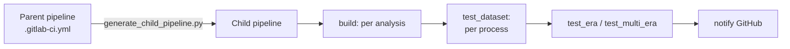

# Integration pipeline

The **FLAF integration pipeline** runs the actual analysis pipeline end-to-end (on tiny test
inputs) to check that a change produces correct results — not just that it is well formatted. It
runs on **GitLab CI at CERN** (project
[`cms-flaf/flaf_integration`](https://gitlab.cern.ch/cms-flaf/flaf_integration), project id
`210600`) and is triggered from GitHub by a bot comment.

## Triggering it: `@cms-flaf-bot please test`

On a pull request (in a repo that supports it), an authorised user posts a comment:

```text
@cms-flaf-bot please test
```

The `trigger-flaf-integration.yaml` workflow then:

1. checks the commenter is in `authorized_users` and the header is recognised;
2. reads `.github/integration_cfg.yaml` **from the PR's branch**;
3. substitutes the PR's own version (so the pipeline tests *this* PR);
4. triggers the GitLab pipeline and posts back a `[pipeline#…] started` comment (or a 👎 reaction if
   it could not start).

Repos with the trigger enabled: HH_bbtautau, HH_bbWW, H_mumu, FLAF, Corrections, StatInference.

!!! tip "Test a change that spans repositories"
    Add lines to point a dependency at your PR or branch, e.g.:
    ```text
    @cms-flaf-bot please test
    - https://github.com/cms-flaf/FLAF/pull/272
    - https://github.com/cms-flaf/PlotKit/pull/2
    ```
    Shorthands include `- <repo>_version=PR_<n>`, a `…/pull/<n>` URL, a `…/tree/<branch>` URL, and
    `- gitlab_branch=<branch>` to run a non-default `flaf_integration` branch. `PlotKit_version`
    pins the `FLAF/PlotKit` sub-sub-module, which is switched after `FLAF` (so it overrides whatever
    commit the requested `FLAF` pins).

## `integration_cfg.yaml`

Each participating repo has `.github/integration_cfg.yaml`. It lists who may trigger, the accepted
comment headers, and the **variables** passed to the pipeline:

```yaml
variables:
  HH_bbtautau_version: "main"
  FLAF_version: "default"          # "default" = keep flaf_integration's current value
  Corrections_version: "default"
  HH_bbtautau_active: "1"          # "1" = run this analysis, "0" = skip
  HH_bbtautau_task: "FLAF.Analysis.tasks.HistPlotTask"
  HH_bbtautau_args: "--branches 0 --test 1000"
  HH_bbtautau_eras: "Run3_2022 Run3_2022EE Run3_2023 Run3_2023BPix"
  HH_bbtautau_processes: "custom_CI_Signal custom_CI_Background custom_CI_Data"
  TEST_TIMEOUT: "4h"
```

| Variable | Meaning |
|---|---|
| `<ana>_active` | Whether to run that analysis (`1`/`0`). |
| `<ana>_version` / `<pkg>_version` | Which version of a repo to use; `default` keeps the pipeline's current value. |
| `<ana>_task` | The target task (the pipeline runs everything up to it). |
| `<ana>_args` | Extra `law run` arguments (e.g. `--branches 0 --test 1000`). |
| `<ana>_eras` | Eras to test (space-separated, or `ALL`). |
| `<ana>_processes` | The processes to test (space-separated). **Required** for an active analysis — there is no default. |

!!! warning "`<ana>_processes` must be set for an active analysis"
    The pipeline **errors at generation time** if an active analysis has no `processes`. The values
    live in each repo's `integration_cfg.yaml` (capitalised for HH analyses, lower-case for H→μμ —
    see [Processes & models](../configuration/processes-and-models.md)). They are declared but left
    empty in `flaf_integration/.gitlab-ci.yml`, so the trigger accepts them while the real values
    come from the triggering repo.

### Root packages vs packages

The shared trigger logic distinguishes:

- **root packages** — repos with an `_active` variable (the analyses: HH_bbtautau, HH_bbWW,
  H_mumu);
- **packages** — repos with a `_version` but no `_active` (FLAF, PlotKit, Corrections,
  StatInference). `PlotKit` is a sub-sub-module (`FLAF/PlotKit`); the build switches it after
  `FLAF`.

Both may trigger the pipeline; the distinction matters only when editing the trigger logic.

## What the pipeline does



- The **parent** pipeline runs `scripts/generate_child_pipeline.py`, which expands the active
  analyses × eras × processes into concrete jobs (pure Python, no PyYAML on the runner).
- The **child** pipeline builds each active analysis once, then runs the requested task per
  process/era on tiny inputs (`--test`), and finally notifies GitHub of success/failure.
- Disabled analyses/eras are simply not emitted; jobs are non-interruptible so parallel pipelines
  on the same branch don't cancel each other.

## Reproducing CI locally

You can run what a CI job runs without the bot — point `fs_default` at a local path, use
`phys_model: TestModel` and `--test 1000`, and launch the target task with `--workflow local`. See
[Your first run](../getting-started/first-run.md) and the
[`user_custom.yaml` guide](../configuration/user-custom.md).
