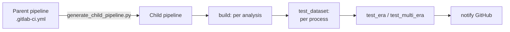

# Integration pipeline

The **FLAF integration pipeline** runs the actual analysis pipeline end-to-end (on tiny test
inputs) to check that a change produces correct results — not just that it is well formatted. It
runs on **GitLab CI at CERN** (project
[`cms-flaf/flaf_integration`](https://gitlab.cern.ch/cms-flaf/flaf_integration), project id
`210600`) and is triggered from GitHub by a bot comment.

## Triggering it: `@cms-flaf-bot please test`

On a pull request (in a repo that supports it), an authorised user posts a comment:

```text
@cms-flaf-bot please test
```

The `trigger-flaf-integration.yaml` workflow then:

1. checks the commenter is in `authorized_users` and the header is recognised;
2. reads `.github/integration_cfg.yaml` **from the PR's branch**;
3. substitutes the PR's own version (so the pipeline tests *this* PR);
4. triggers the GitLab pipeline and posts back a `[pipeline#…] started` comment (or a 👎 reaction if
   it could not start).

Repos with the trigger enabled: HH_bbtautau, HH_bbWW, H_mumu, FLAF, Corrections, StatInference.

!!! tip "Test a change that spans repositories"
    Add lines to point a dependency at your PR or branch, e.g.:
    ```text
    @cms-flaf-bot please test
    - https://github.com/cms-flaf/FLAF/pull/272
    - https://github.com/cms-flaf/PlotKit/pull/2
    ```
    Shorthands include `- <repo>_version=PR_<n>`, a `…/pull/<n>` URL, a `…/tree/<branch>` URL, and
    `- gitlab_branch=<branch>` to run a non-default `flaf_integration` branch. `PlotKit_version`
    pins the `FLAF/PlotKit` sub-sub-module, which is switched after `FLAF` (so it overrides whatever
    commit the requested `FLAF` pins).

!!! tip "Running on GitHub Actions (as a backup when CERN GitLab has issues)"
    To run the integration tests directly on GitHub Actions instead of CERN GitLab:
    ```text
    @cms-flaf-bot please test
    - ci_backend = github
    ```
    (Aliases `- backend=github` and `- provider=github` are also accepted).

## `integration_cfg.yaml`

Each participating repo has `.github/integration_cfg.yaml`. It lists who may trigger, the accepted
comment headers, and the **variables** passed to the pipeline:

```yaml
variables:
  HH_bbtautau_version: "main"
  FLAF_version: "default"          # "default" = keep flaf_integration's current value
  Corrections_version: "default"
  HH_bbtautau_active: "1"          # "1" = run this analysis, "0" = skip
  HH_bbtautau_task: "FLAF.Analysis.tasks.HistPlotTask"
  HH_bbtautau_args: "--branches 0 --test 1000"
  HH_bbtautau_eras: "Run3_2022 Run3_2022EE Run3_2023 Run3_2023BPix Run3_2024 Run3_2025 Run3_2026"
  HH_bbtautau_processes: "custom_CI_Signal custom_CI_Background_TT custom_CI_Background_DY custom_CI_Data"
  ci_backend: "gitlab"             # "gitlab" (default) or "github"
  TEST_TIMEOUT: "4h"
```

| Variable | Meaning |
|---|---|
| `<ana>_active` | Whether to run that analysis (`1`/`0`). |
| `<ana>_version` / `<pkg>_version` | Which version of a repo to use; `default` keeps the pipeline's current value. |
| `<ana>_task` | The target task (the pipeline runs everything up to it). |
| `<ana>_args` | Extra `law run` arguments (e.g. `--branches 0 --test 1000`). |
| `<ana>_eras` | Eras to test (explicit space-separated list). **Required** for an active analysis. |
| `<ana>_processes` | The processes to test (space-separated). **Required** for an active analysis — there is no default. |
| `ci_backend` | CI execution engine: `gitlab` (default, CERN GitLab pipeline) or `github` (GitHub Actions with CVMFS). |

!!! warning "`<ana>_processes` and `<ana>_eras` must be set for an active analysis"
    Generation **errors out** if an active analysis has no `processes` or no `eras`, or if no
    analysis is active at all — a misconfigured trigger fails instead of quietly testing something
    else. Whether an analysis supports a requested era is decided by its own configuration, so an
    unsupported era fails in the job that runs the task. The process values live in
    `integration_cfg.yaml` (capitalised for HH analyses, lower-case for H→μμ — see
    [Processes & models](../configuration/processes-and-models.md)). They are declared but left
    empty in `flaf_integration/.gitlab-ci.yml`, so the trigger accepts them while the real values
    come from the triggering repo.

### Root packages vs packages

The shared trigger logic distinguishes:

- **root packages** — repos with an `_active` variable (the analyses: HH_bbtautau, HH_bbWW,
  H_mumu);
- **packages** — repos with a `_version` but no `_active` (FLAF, PlotKit, Corrections,
  StatInference). `PlotKit` is a sub-sub-module (`FLAF/PlotKit`); the build switches it after
  `FLAF`.

Both may trigger the pipeline; the distinction matters only when editing the trigger logic.

## What the pipeline does


```mermaid
flowchart LR
    P[Parent pipeline<br/>.gitlab-ci.yml] -->|generate_child_pipeline.py| C[Child pipeline]
    C --> B[build: per analysis]
    B --> T1[test_dataset:<br/>per process]
    T1 --> T2[test_era / test_multi_era]
    T2 --> N[notify GitHub]
```

- The **parent** pipeline runs `scripts/generate_child_pipeline.py`, which expands the active
  analyses × eras × processes into concrete jobs (pure Python, no PyYAML on the runner).
- The **child** pipeline builds each active analysis once, then runs the requested task per
  process/era on tiny inputs (`--test`).
- The **parent** then notifies GitHub of success/failure. The result comment is more than
  pass/fail: it lists the active analysis and any non-default dependency (`FLAF`, `PlotKit`,
  `Corrections`, `StatInference`) with the commit SHA resolved when the pipeline was triggered
  (the PR head or branch tip), each linked to GitHub. That is the revision that was tested,
  even if further commits were pushed to the PR while CI was still running. A SHA is omitted
  only when it was not resolved (typically `_version: default`, or a failed GitHub lookup).
  Example:

    ```text
    [pipeline#12345](https://gitlab.cern.ch/cms-flaf/flaf_integration/-/pipelines/12345) passed

    - HH_bbtautau ([PR #87](https://github.com/cms-flaf/HH_bbtautau/pull/87)): [`0123456`](https://github.com/cms-flaf/HH_bbtautau/commit/0123456)
    - FLAF ([PR #301](https://github.com/cms-flaf/FLAF/pull/301)): [`fedcba9`](https://github.com/cms-flaf/FLAF/commit/fedcba9)
    ```
- Disabled analyses/eras are simply not emitted; jobs are non-interruptible so parallel pipelines
  on the same branch don't cancel each other.

### The GitHub Actions backend

With `ci_backend: github` the same stages run as GitHub Actions jobs
(`FLAF/.github/workflows/integration-test.yaml`, scripts in `FLAF/.github/scripts/ci/`), inside the
`kandrosov/flaf` container with CVMFS mounted:

- **build** (one job per analysis) assembles the checkout at the requested revisions *and installs
  the analysis environment* (`flaf_env`, CMSSW, combine) into `soft/`. The result is passed to the
  test jobs as a single compressed **tar** archive — a plain directory artifact is a zip and would
  lose the symlinks (`flaf_env` links into CVMFS) and the executable bits.
- **test jobs** unpack that archive and run with `FLAF_NO_INSTALL=1`, so they reuse the
  environment instead of re-installing it (which used to cost ~20 min per job) and fail loudly if
  anything is missing.
- The build itself is cached across runs, like the install cache on EOS used by the GitLab
  pipeline: a *reference* checkout (default branches, environment installed) is kept in the GitHub
  Actions cache under a weekly key, and the requested revisions are applied on top of it. Set
  `rebuild_cache: "1"` in the trigger variables to force a rebuild from scratch.
- The build area is mounted at the same path (`/flaf_ci`) in every job, because the installed
  virtualenv and the CMSSW/SCRAM areas record their own location and cannot be relocated.
- `fs_default` from `ci_custom.yaml` points at the GitLab job directory, so the test script passes
  a generated `--user-custom` overlay that redirects the CI output area into the shared build
  volume; each stage uploads `output/` and `data/CI` as artifacts for the next one.

## Reproducing CI locally

You can run what a CI job runs without the bot — point `fs_default` at a local path, use
`phys_model: TestModel` and `--test 1000`, and launch the target task with `--workflow local`. See
[Your first run](../getting-started/first-run.md) and the
[`user_custom.yaml` guide](../configuration/user-custom.md).
