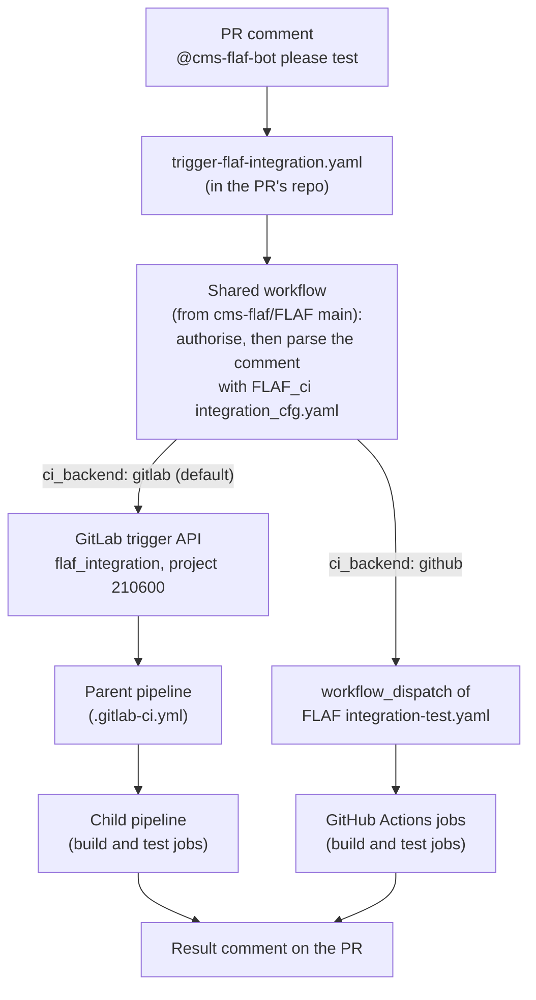
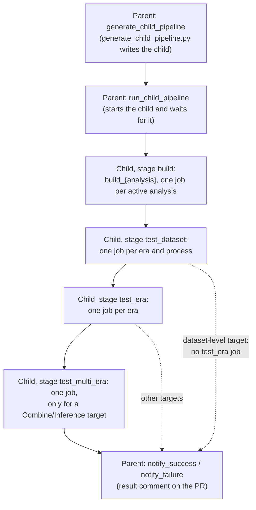

# Integration pipeline

The **FLAF integration pipeline** runs the actual analysis pipeline end-to-end (on tiny test
inputs) to check that a change produces correct results — not just that it is well formatted. It
runs on **GitLab CI at CERN** (project
[`cms-flaf/flaf_integration`](https://gitlab.cern.ch/cms-flaf/flaf_integration), project id
`210600`) and is triggered from GitHub by a bot comment. The same stages can also run on
[GitHub Actions](#the-github-actions-backend) as a backup.

## Triggering it: `@cms-flaf-bot please test`

On a pull request in a repo that supports it, a member of the **`cms-flaf` GitHub organisation**
posts a comment:

```text
@cms-flaf-bot please test
```

Repos with the trigger enabled: HH_bbtautau, HH_bbWW, H_mumu, FLAF, PlotKit, Corrections,
StatInference. The workflow `.github/workflows/trigger-flaf-integration.yaml` runs on every new or
**edited** PR comment. In FLAF it is the shared implementation itself (and a FLAF PR that changes
the trigger scripts is triggered with the PR's own copies of them); every other repo has a thin
wrapper that calls it at `cms-flaf/FLAF@main`. The workflow then:

1. checks that the commenter is a member of the `cms-flaf` organisation — and, if the PR changes
   anything under `.github/`, that the commenter is `kandrosov`. Anyone else is **ignored
   silently** (no reply, no reaction);
2. reads the configuration from [`integration_cfg.yaml`](#integration_cfgyaml) in
   **`cms-flaf/FLAF_ci`** (branch `main`) — not from the PR's repo;
3. checks the comment's first line against the accepted headers and parses the lines after it;
4. sets `<repo>_version: PR_<n>` for the PR's own repo, so the pipeline tests *this* PR, and
   resolves every requested revision to a commit SHA (`<repo>_expected_sha`), which the GitLab
   test jobs later check is contained in their checkout;
5. starts the pipeline and replies with a `[pipeline#…] started` comment (on the GitHub Actions
   backend: `[GitHub Actions integration workflow] dispatched for …`). If the comment mentions
   the bot but nothing could be started — unrecognised header, invalid line, trigger API error —
   the comment gets a 👎 reaction instead.


```mermaid
flowchart TD
    C["PR comment<br/>@cms-flaf-bot please test"] --> W["trigger-flaf-integration.yaml<br/>(in the PR's repo)"]
    W --> S["Shared workflow<br/>(from cms-flaf/FLAF main):<br/>authorise, then parse the comment<br/>with FLAF_ci integration_cfg.yaml"]
    S -->|"ci_backend: gitlab (default)"| G["GitLab trigger API<br/>flaf_integration, project 210600"]
    S -->|"ci_backend: github"| A["workflow_dispatch of<br/>FLAF integration-test.yaml"]
    G --> P["Parent pipeline<br/>(.gitlab-ci.yml)"]
    P --> K["Child pipeline<br/>(build and test jobs)"]
    A --> J["GitHub Actions jobs<br/>(build and test jobs)"]
    K --> R["Result comment on the PR"]
    J --> R
```

**What gets tested** depends on where the PR is. A PR in an **analysis** repo runs only that
analysis (the trigger sets the other analyses' `_active` to `0`). A PR in **FLAF, PlotKit,
Corrections or StatInference** runs every analysis that is active in `integration_cfg.yaml`
(currently all three), each with that submodule switched to the PR (see `<pkg>_version`
[below](#integration_cfgyaml)).

!!! tip "Test a change that spans repositories"
    Add lines to point a dependency at your PR or branch, e.g.:

    ```text
    @cms-flaf-bot please test
    - https://github.com/cms-flaf/FLAF/pull/272
    - https://github.com/cms-flaf/PlotKit/pull/2
    ```

    The comment format is strict:

    - Blank lines and lines starting with `#`, `<!--` or ```` ``` ```` are skipped everywhere.
      The first remaining line must start with one of the accepted headers:
      `@cms-flaf-bot please test`, `@cms-flaf-bot test`, or the same with the
      `[@cms-flaf-bot](https://github.com/cms-flaf-bot)` link form.
    - **Every** further line starts with `- ` or `* ` and is one of: a `…/<repo>/pull/<n>` URL, a
      `…/<repo>/tree/<branch>` URL, or `key=value`. Accepted keys are `gitlab_branch` (alias
      `gitlab_ref`) to run a non-default `flaf_integration` branch, `ci_backend` (aliases
      `backend`, `provider`, `runner`), and any variable of `integration_cfg.yaml` — e.g.
      `- FLAF_version=PR_272` (a branch name or a PR/tree URL is also accepted as the value),
      `- H_mumu_eras=Run3_2022`, `- rebuild_cache=1`.
    - Any other line — an unknown repo or variable, a trailing `# comment` after a URL, a value that
      itself contains `=` — **aborts the whole trigger** with a 👎 reaction.

    Only the repo name is taken from a URL: revisions are always fetched from the `cms-flaf`
    repository, so a branch that exists only in a fork is tested through its PR URL.
    `PlotKit_version` pins the `FLAF/PlotKit` sub-sub-module, which is switched after `FLAF` (so it
    overrides whatever commit the requested `FLAF` pins).

!!! tip "Running on GitHub Actions (as a backup when CERN GitLab has issues)"
    To run the integration tests directly on GitHub Actions instead of CERN GitLab:
    ```text
    @cms-flaf-bot please test
    - ci_backend = github
    ```
    (Aliases `- backend=github`, `- provider=github` and `- runner=github` are also accepted.)

## `integration_cfg.yaml`

The trigger configuration is a **single file shared by all repos**: `integration_cfg.yaml` at the
root of [`cms-flaf/FLAF_ci`](https://github.com/cms-flaf/FLAF_ci), read from its `main` branch.
Changing what CI runs by default (eras, processes, target tasks) is therefore a PR to FLAF_ci. It
lists the accepted comment headers, the **variables** passed to the pipeline, and the GitLab
trigger URL and branch. An excerpt (the file carries the same keys for HH_bbWW and H_mumu):

```yaml
expected_headers:
  - "@cms-flaf-bot test"
  - "@cms-flaf-bot please test"
  # ... and the same two with the [@cms-flaf-bot](https://github.com/cms-flaf-bot) link form

variables:
  HH_bbtautau_version: "main"
  FLAF_version: "default"          # "default" = the commit the analysis checkout pins
  PlotKit_version: "default"
  Corrections_version: "default"
  StatInference_version: "default"
  HH_bbtautau_active: "1"          # "1" = run this analysis, "0" = skip
  HH_bbtautau_task: "FLAF.Analysis.tasks.HistPlotTask"
  HH_bbWW_task: "StatInference.law.tasks.ResonantLimitsAndHistPlotTask"
  HH_bbtautau_args: "--test 1000"
  HH_bbtautau_processes: "custom_CI_Signal custom_CI_Background_TT custom_CI_Background_DY custom_CI_Data"
  HH_bbtautau_eras: "Run3_2022 Run3_2022EE Run3_2023 Run3_2023BPix Run3_2024 Run3_2025 Run3_2026"
  rebuild_cache: "0"
  ci_backend: "gitlab"             # "gitlab" (default) or "github"
  TEST_TIMEOUT: "4h"

gitlab_url: "https://gitlab.cern.ch/api/v4/projects/210600/trigger/pipeline"
gitlab_branch: "master"            # flaf_integration branch to run
```

!!! note "Leftover `.github/integration_cfg.yaml` files"
    Corrections and StatInference still carry an old `.github/integration_cfg.yaml` with an
    `authorized_users` list. Nothing reads those files: who may trigger is decided by
    `cms-flaf` organisation membership, and the configuration comes from FLAF_ci.

| Variable | Meaning |
|---|---|
| `<ana>_active` | Whether to run that analysis (`1`/`0`). |
| `<ana>_version` / `<pkg>_version` | Which revision of a repo to use: a branch name (its tip), `PR_<n>` (on GitLab, the PR head **merged into the PR's base branch**, looked up on GitHub — so a PR to `next_prod` is tested against `next_prod`), or `default` (leave the submodule at the commit the analysis checkout pins). |
| `<ana>_task` | The target task (the pipeline runs everything up to it — see the table [below](#what-the-pipeline-does)). |
| `<ana>_args` | Extra `law run` arguments (`--test 1000` for all three analyses). |
| `<ana>_eras` | Eras to test (space-separated). |
| `<ana>_processes` | The processes to test (space-separated). **Required** for an active analysis — there is no default. |
| `rebuild_cache` | `1` rebuilds the cached reference installation from scratch instead of reusing it. |
| `ci_backend` | CI execution engine: `gitlab` (default, CERN GitLab pipeline) or `github` (GitHub Actions with CVMFS). |
| `TEST_TIMEOUT` | Time limit of the `law run` inside each test job. |

`<repo>_expected_sha` is not in the file: the trigger adds it for every resolved revision (a
`default` version has none).

!!! warning "`<ana>_processes` and `<ana>_eras` for an active analysis"
    Generation **errors out** if an active analysis has no `processes`, or if no analysis is active
    at all — a misconfigured trigger fails instead of quietly testing something else. The eras are
    handled differently by the two backends:

    - **GitLab**: an empty value or `ALL` means every era in `AVAILABLE_ERAS` of
      `flaf_integration/.gitlab-ci.yml`; an era not in that list fails the generation.
    - **GitHub Actions**: an explicit list is required (empty fails the generation); era names
      are not checked there.

    Whether an analysis supports a listed era is decided by its own configuration, so an
    unsupported era fails in the job that runs the task. The process values live in
    `integration_cfg.yaml` (capitalised for HH analyses, lower-case for H→μμ — see
    [Processes & models](../configuration/processes-and-models.md)). The GitLab child-pipeline
    generator reads only the variables declared in `flaf_integration/.gitlab-ci.yml` (the values
    there are fallbacks); the `*_processes` variables are declared there with empty values, so
    their real values must come from `integration_cfg.yaml`.

### Root packages vs packages

The shared trigger logic distinguishes:

- **root packages** — repos with an `_active` variable (the analyses: HH_bbtautau, HH_bbWW,
  H_mumu);
- **packages** — repos with a `_version` but no `_active` (FLAF, PlotKit, Corrections,
  StatInference). `PlotKit` is a sub-sub-module (`FLAF/PlotKit`); the build switches it after
  `FLAF`.

Both may trigger the pipeline. The difference is what runs: a PR in a root package switches the
other analyses off, a PR in a package leaves every analysis at its `_active` value. The GitLab
result comment lists every active analysis, and a package only if its version is not `default`.

## What the pipeline does


```mermaid
flowchart TD
    G["Parent: generate_child_pipeline<br/>(generate_child_pipeline.py writes the child)"] --> T["Parent: run_child_pipeline<br/>(starts the child and waits for it)"]
    T --> B["Child, stage build:<br/>build_{analysis}, one job per active analysis"]
    B --> D["Child, stage test_dataset:<br/>one job per era and process"]
    D --> E["Child, stage test_era:<br/>one job per era"]
    E --> M["Child, stage test_multi_era: one job,<br/>only for a Combine/Inference target"]
    M --> N["Parent: notify_success / notify_failure<br/>(result comment on the PR)"]
    E -.->|"other targets"| N
    D -.->|"dataset-level target:<br/>no test_era job"| N
```

- The **parent** pipeline (`.gitlab-ci.yml`) runs `scripts/generate_child_pipeline.py`, which
  expands the active analyses × eras × processes into concrete jobs (pure Python, no PyYAML on
  the runner), and then runs that child pipeline.
- The **build** job assembles each active analysis once. It starts from a cached reference
  installation (default branches, all Git LFS objects) kept on EOS, rebuilt when it is older than
  a week or when `rebuild_cache` is `1`, then switches the analysis and its submodules to the
  requested versions (`FLAF`, then `FLAF/PlotKit`, `Corrections`, `StatInference`). The result
  reaches the test jobs as a tarball on EOS, not as a GitLab artifact.
- Each **test** job unpacks that build, checks it contains every `<repo>_expected_sha`, copies
  the analysis's `config/ci_custom.yaml` to `config/user_custom.yaml` and runs

    ```sh
    law run <task> --version CI --period <era> --workflow local --workers $LAW_WORKERS <ana>_args
    ```

    (plus `--process <proc>` in the `test_dataset` jobs). A failed `law run` is retried once;
    a timeout is not.

- Which task each stage runs depends on `<ana>_task`:

    | Target task | `test_dataset` (per era and process) | `test_era` (per era) | `test_multi_era` |
    |---|---|---|---|
    | `FLAF.Analysis.tasks.NanoAODProducerTask` (listed by the generator, but no such task exists in FLAF), `…HistTupleProducerTask` or `…HistFromNtupleProducerTask` | the target | — | — |
    | Full name contains `Combine` or `Inference` (e.g. HH_bbWW's `StatInference.law.tasks.ResonantLimitsAndHistPlotTask`) | `HistFromNtupleProducerTask` | `HistPlotTask` | the target, once, with `--period` set to the first era |
    | Anything else (e.g. `FLAF.Analysis.tasks.HistPlotTask`) | `HistFromNtupleProducerTask` | the target | — |

    The test is a substring match on the full task name, so any task under `StatInference.`
    gets the multi-era job. The GitHub Actions backend uses the same mapping.

- The **parent** then notifies GitHub of success/failure. The result comment is more than
  pass/fail: it lists the active analysis and any non-default dependency (`FLAF`, `PlotKit`,
  `Corrections`, `StatInference`) with the commit SHA resolved when the pipeline was triggered
  (the PR head or branch tip), each linked to GitHub. That is the revision that was tested,
  even if further commits were pushed to the PR while CI was still running. A SHA is omitted
  only when it was not resolved (typically `_version: default`, or a failed GitHub lookup).
  Example:

    ```text
    [pipeline#12345](https://gitlab.cern.ch/cms-flaf/flaf_integration/-/pipelines/12345) passed

    - HH_bbtautau ([PR #87](https://github.com/cms-flaf/HH_bbtautau/pull/87)): [`0123456`](https://github.com/cms-flaf/HH_bbtautau/commit/0123456)
    - FLAF ([PR #301](https://github.com/cms-flaf/FLAF/pull/301)): [`fedcba9`](https://github.com/cms-flaf/FLAF/commit/fedcba9)
    ```

- Disabled analyses/eras are simply not emitted; jobs are non-interruptible so parallel pipelines
  on the same branch don't cancel each other. A job that fails for an infrastructure reason
  (runner, scheduler or API failure, a stuck job, a GitLab job timeout) is retried automatically,
  up to twice; a job whose script fails is not.

### The GitHub Actions backend

With `ci_backend: github` the same stages run as GitHub Actions jobs
(`FLAF/.github/workflows/integration-test.yaml`, scripts in `FLAF/.github/scripts/ci/`), inside the
`kandrosov/flaf` container with CVMFS mounted. The trigger dispatches that workflow on
`cms-flaf/FLAF` at `main`, whichever repo the PR is in, so the run appears under FLAF's Actions
tab.

- **build** (one job per analysis) assembles the checkout at the requested revisions *and installs
  the analysis environment* (`flaf_env`, CMSSW, combine) into `soft/`. The result is passed to the
  test jobs as a single compressed **tar** archive — a plain directory artifact is a zip and would
  lose the symlinks (`flaf_env` links into CVMFS) and the executable bits.
- Unlike the GitLab build, a `PR_<n>` version is merged into the current checkout without looking
  up the PR's base branch — for a submodule, that is the commit the analysis pins.
- **test jobs** unpack that archive and run with `FLAF_NO_INSTALL=1`, so they reuse the
  environment instead of re-installing it (which used to cost ~20 min per job) and fail loudly if
  anything is missing.
- The build itself is cached across runs, like the install cache on EOS used by the GitLab
  pipeline: a *reference* checkout (default branches, environment installed) is kept in the GitHub
  Actions cache under a weekly key, and the requested revisions are applied on top of it. Set
  `rebuild_cache: "1"` in the trigger variables to force a rebuild from scratch.
- A cached environment built for another law release than the one `FLAF/env.sh` pins is brought
  to the pin by `env.sh` itself (a `pip install law==<pin>` in place, on both backends), so a
  cached reference never makes a run test against a stale law; the saved reference carries the
  new release once its key rotates (GitHub, weekly) or the EOS cache expires (GitLab, a week), or
  at once with `rebuild_cache: "1"`.
- The build area is mounted at the same path (`/flaf_ci`) in every job, because the installed
  virtualenv and the CMSSW/SCRAM areas record their own location and cannot be relocated.
- `fs_default` from `ci_custom.yaml` points at the GitLab job directory, so the test script passes
  a generated `--user-custom` overlay that redirects the CI output area into the shared build
  volume; each stage uploads `output/` and `data/CI` as artifacts for the next one.
- The final comment is a plain `passed`/`failed` line linking the Actions run, without the list of
  tested revisions.

## Reproducing CI locally

You can run what a CI job runs without the bot. From the analysis checkout (with `env.sh`
sourced), copy the analysis's `config/ci_custom.yaml` (`phys_model: TestModel` and the CI
histogram settings), point its `fs_default` at a local path, and launch the target task the way a
test job does:

```sh
cp config/ci_custom.yaml ci_local.yaml     # then point fs_default at a local path
law run FLAF.Analysis.tasks.HistPlotTask --version CI --period Run3_2022 --workflow local \
    --test 1000 --user-custom ci_local.yaml
```

CI itself replaces `config/user_custom.yaml` with `ci_custom.yaml`; `--user-custom` is loaded
after your own `config/user_custom.yaml` instead, so a top-level key set only there still applies.

See [Your first run](../getting-started/first-run.md) and the
[`user_custom.yaml` guide](../configuration/user-custom.md).
