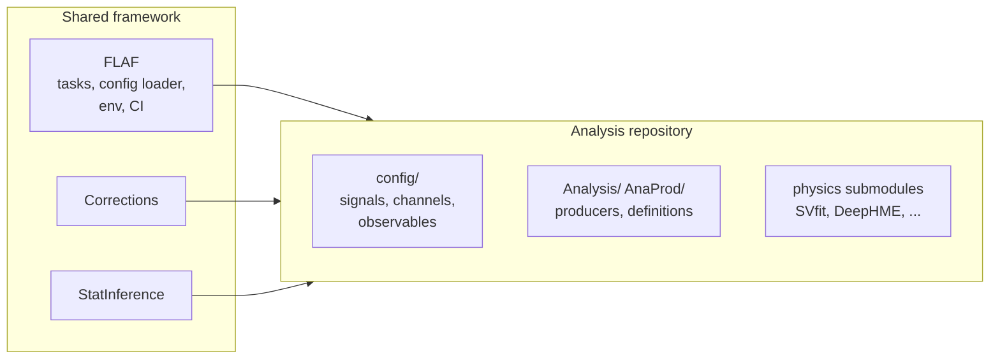

# Architecture

FLAF is a **shared framework** used by several analyses. This page explains how the pieces fit
together — which repositories exist, how they are nested as git submodules, and what is "common"
versus "analysis-specific".

## Repositories

| Repository | Role | Host |
|---|---|---|
| [`FLAF`](https://github.com/cms-flaf/FLAF) | The framework: task definitions, config system, environment, CI. | GitHub |
| [`Corrections`](https://github.com/cms-flaf/Corrections) | Object corrections & systematics (pileup, b-tag, triggers, …). | GitHub |
| [`StatInference`](https://github.com/cms-flaf/StatInference) | Datacard creation and limit/fit tooling. | GitHub |
| [`inference`](https://gitlab.cern.ch/cms-flaf/inference) | The HH combine-based inference tooling (`dhi`). | CERN GitLab |
| `HH_bbtautau`, `HH_bbWW`, `H_mumu` | The **analysis** repositories. | GitHub |

The first four are **shared** — every analysis uses the same `FLAF` and `Corrections`; the two HH
analyses also use `StatInference` and `inference`. They are pulled into each analysis as git
submodules pinned to a specific commit, so an analysis always builds against a known version of
the framework.

## Submodule hierarchy

You clone an **analysis** repository; it brings the shared framework and the analysis-specific
tools with it. For example, HH→bb̄ττ looks like this:

```text
HH_bbtautau/                  ← the analysis repository (you clone this)
├── FLAF/                     ← shared framework (submodule)
│   ├── PlotKit/              ← plotting helpers (submodule of FLAF)
│   └── RunKit/               ← workflow utilities (vendored directory, not a submodule)
├── Corrections/              ← shared corrections (submodule)
├── StatInference/            ← shared stat tooling (submodule; HH analyses only)
├── inference/                ← HH combine tooling (submodule; HH analyses only)
├── ClassicSVfit/ SVfitTF/    ← analysis-specific physics tools (submodules)
├── HHKinFit2/ HHbtag/        ← analysis-specific physics tools (submodules)
├── SyncTool/                 ← analysis-specific (submodule)
├── Analysis/ AnaProd/        ← analysis-specific task/producer code
├── config/                   ← analysis-specific configuration (signals, channels, …)
├── env.sh                    ← the entry point you `source`
└── data/                     ← local working area (proxy, small outputs)
```

Each analysis carries a different set of physics submodules:

- **HH_bbtautau** — SVfit (`ClassicSVfit`, `SVfitTF`), `HHKinFit2`, `HHbtag`, `SyncTool`.
- **HH_bbWW** — `DeepHME`, `SyncTool`.
- **H_mumu** — the simplest: just `FLAF` and `Corrections` (no `StatInference`/`inference`).

See [Analyses](../analyses.md) for what each one adds on top of the framework.

## Common vs analysis-specific

Understanding this split tells you *where to look* for any given thing.



- **In `FLAF`**: the *machinery* — the task classes (`AnaProd/tasks.py`, `Analysis/tasks.py`), the
  configuration loader (`Common/Setup.py`), the environment (`env.sh`), cross-sections and the
  SM-background/data dataset lists common to all analyses, and the shared CI workflows.
- **In the analysis repository**: the *physics* — which signals to run, the channels and
  categories, the analysis-specific observables and producers, and the analysis-specific
  configuration that overrides or extends the framework defaults.

The [configuration system](configuration.md) is what merges these two layers together at run
time, and the [data flow](data-flow.md) is what the shared tasks actually do with them.

!!! note "Developing the shared submodules"
    Because `FLAF`/`Corrections` are pinned submodules, editing them inside an analysis checkout
    requires care so your edits are actually picked up. The environment supports pointing
    `FLAF_PATH`/`CORRECTIONS_PATH` at an edited copy — see
    [The environment](environment.md#developing-shared-submodules) and
    [Contributing](../contributing.md).
