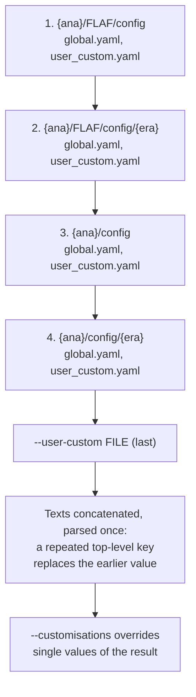

# Configuration system

FLAF's behaviour — which datasets exist, which corrections apply, where outputs go, which
processes make up the analysis — is driven by **YAML configuration**. This page explains *how* the
configuration is assembled. For *how to change* specific things, see the
[Configuration guide](../configuration/user-custom.md).

The implementation lives in `FLAF/Common/Setup.py`.

## Four layers, merged in order

When you run a task with `--period <era>`, FLAF loads configuration from **four directories**, in
this order:

```python
config_path_order = [
    "<analysis>/FLAF/config",          # 1. framework defaults (all analyses)
    "<analysis>/FLAF/config/<era>",    # 2. framework defaults for this era
    "<analysis>/config",               # 3. analysis-wide settings
    "<analysis>/config/<era>",         # 4. analysis settings for this era
]
```

Think of it as **general → specific**: the framework provides sensible cross-analysis defaults
(layer 1–2), and each analysis overrides or extends them (layer 3–4). The per-era directories let
2022 and 2023 differ without duplicating everything.

Each kind of configuration is looked up under its own file name in all four directories (a
missing file is skipped): `datasets.yaml`, `processes.yaml`, `phys_models.yaml`, `weights.yaml`,
`plot/histograms.yaml`. The **global** settings are special: in every directory FLAF reads
`global.yaml` and then `user_custom.yaml`, and a file passed with `--user-custom` comes last
(`{ana}` below is the analysis checkout, `$ANALYSIS_PATH`).



!!! warning "The framework layers come from the analysis's FLAF submodule"
    Layers 1–2 are always read from `<analysis>/FLAF/config` — also when `FLAF_PATH` points at a
    [dev-overlay](environment.md#developing-shared-submodules) copy of FLAF. An edit to
    `config/` in the overlay copy is therefore not seen by `Setup`.

### How values combine

FLAF does **not** merge values key by key. For each kind of configuration it concatenates the
*text* of all the files it finds, in the order above, and parses the result as one YAML
document. Two consequences follow:

- **A repeated top-level key replaces the earlier value wholesale** — scalars, lists and nested
  maps alike. The last file that sets a key has the final say. An era-level `corrections:` block,
  for example, replaces the analysis-wide one entirely instead of adding to it, so it has to
  repeat every entry it wants to keep — or inherit them with an anchor, below.
- **YAML anchors work across files.** An anchor defined in an earlier file can be referenced in a
  later one. Top-level keys starting with `.` are dropped after parsing, so an analysis keeps
  shared blocks under such keys — e.g. the `.DY_processors: &DY_processors` definitions in
  `config/processes.yaml`, used as `processors: *DY_processors` in `config/<era>/processes.yaml`.
  An era file can also override part of a top-level block with a merge key, so that what it does
  not override stays in step with the analysis-wide block:

    ```yaml
    # config/global.yaml
    corrections: &corrections_default
      pu: { ... }
      btag: { ..., tagger: particleNet }

    # config/Run3_2024/global.yaml
    corrections:
      <<: *corrections_default
      btag: { ..., tagger: UParTAK4 }   # replaces the whole btag entry, the rest is inherited
    ```

    The merge is one level deep: an overridden entry (`btag` here) is replaced as a whole. Setup also
    reads `global.yaml` from the same four directories for the era named in `reuse_mc_from_era` (to
    take its `shared_mc`), so the alias resolves there too. Code that parses an era's `global.yaml`
    on its own, outside `Config`, cannot resolve it.

Datasets combine across layers only because **each dataset is its own top-level key**: SM
backgrounds and data live in the framework's `FLAF/config/<era>/datasets.yaml`, signals and custom
samples in the analysis's `config/<era>/datasets.yaml`, and after loading **all** of them are
available together. A dataset name defined in both files keeps the analysis's entry. See
[Datasets](../configuration/datasets.md).

## The objects you may meet in code

| Class (in `Common/Setup.py`) | Role |
|---|---|
| `Config` | Loads one logical config (e.g. "datasets") from the four directories as described above. Accessed like a dict: `cfg["key"]` (raises `KeyError` when the key is missing), `cfg.get("key", default)`. |
| `Setup` | The master configuration object: the global parameters, the selected datasets and processes, the physics model and more. It expands the [meta-processes](../configuration/processes-and-models.md#meta-processes) while loading. |
| `PhysicsModel` | Classifies each process as **background**, **signal** or **data**, and keeps the list of concrete processes each meta-process expanded into. |

`Setup.getGlobal(...)` returns a cached instance: one per combination of analysis path, period,
version, `--process`/`--dataset`/`--model` selection, `--customisations` and `--user-custom`. Every
task of a run with the same parameters therefore sees the same configuration.

## The key configuration files

| File | Lives in | Holds |
|---|---|---|
| `user_custom.yaml` | analysis `config/` | **Your** personal, git-ignored settings: storage, model, options. [Guide](../configuration/user-custom.md). |
| `global.yaml` | `FLAF/config/<era>/`, analysis `config/` and `config/<era>/` (`FLAF/config/` itself has none) | Global settings: anaTuple/histTuple definitions, corrections, payload producers, signal types, the NanoAOD source. For 2024+ this also holds `weight_base_branch` (`weight_base` for a single year, `weight_base_cmb` for the 24+25+26 combination). `shared_mc` is declared on `Run3_2024` and inherited when `reuse_mc_from_era` is set. |
| `datasets.yaml` | `FLAF/config/<era>/` and analysis `config/<era>/` | Dataset (sample) definitions. [Guide](../configuration/datasets.md). |
| `processes.yaml` | analysis `config/<era>/` (shared YAML anchors in analysis `config/processes.yaml`) | Logical processes built from datasets. [Guide](../configuration/processes-and-models.md). |
| `phys_models.yaml` | analysis `config/` | Which processes are background/signal/data for a model. [Guide](../configuration/processes-and-models.md). |
| `crossSections13p6TeV.yaml` | `FLAF/config/` | Cross-section values referenced by datasets; each era selects its file with `crossSectionsFile` in `global.yaml`. |

!!! tip "Validate your config without running the pipeline"
    Loading `Setup.py` for an era is exactly what the `test-setup-loading` CI check does — it
    catches typos and missing references early. The same check runs locally from the analysis
    checkout with `python FLAF/test/test_setup_loading.py Run3_2022 Run3_2024` (any list of eras);
    if it loads, the config is internally consistent.

## `user_custom.yaml` is part of the merge too

Your `config/user_custom.yaml` adds personal values (storage locations, `phys_model`, options like
`compute_unc_variations`). It is read right after `config/global.yaml`, so it overrides the
framework and analysis-wide settings — but `config/<era>/global.yaml` is read **after** it and
wins for every top-level key it sets (e.g. `corrections`, `nanoAODVersions`, `met_type`). For a
single run you can layer an *extra* file on top with `--user-custom <path>`, which is loaded last
and therefore wins over every file — handy for one-off tests without editing your
`user_custom.yaml`. See
[`user_custom.yaml`](../configuration/user-custom.md#per-run-overrides-user-custom).
