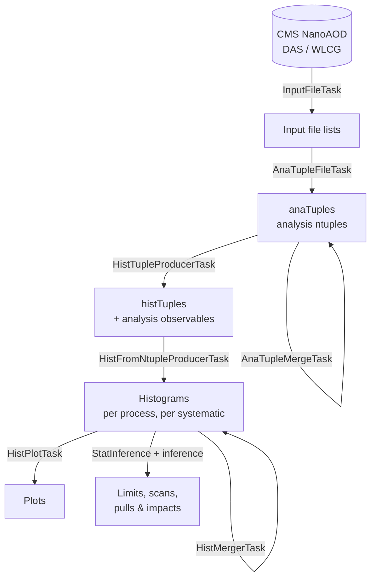

# Data flow

This page follows the data through the pipeline: what each stage consumes, what it produces, and
how the products feed the next stage. It is the conceptual companion to the hands-on
[walkthrough](../workflow/walkthrough.md).

## The pipeline at a glance

## Stage by stage

| Stage (task) | Consumes | Produces |
|---|---|---|
| **InputFileTask** | A DAS query for the requested datasets and era. | The concrete list of NanoAOD files to process. Runs first and cheaply; everything else keys off it. |
| **AnaTupleFileTask** | One NanoAOD file (one branch per file). | One **anaTuple**: a slimmed/skimmed analysis ntuple with the objects, weights and flags the analysis needs. Runs inside CMSSW via `AnaProd/anaTupleProducer.py`. |
| **AnaTupleMergeTask** | The per-file anaTuples for a dataset. | One merged anaTuple per dataset (data merged across runs). |
| **HistTupleProducerTask** | Merged anaTuples. | **histTuples**: ntuples with the heavier analysis **observables** computed (the "payload producers"). |
| **HistFromNtupleProducerTask** | histTuples. | **Histograms** of the requested variables, including systematic variations. Branches over variables. |
| **HistMergerTask** | Per-piece histograms. | Merged histograms per process, ready for plotting and fitting. |
| **HistPlotTask** | Merged histograms. | **Plots** (one branch per variable). |
| **Statistical inference** | Merged histograms / shapes. | Datacards, exclusion limits, likelihood scans, pulls & impacts (via `StatInference` and the `inference`/`dhi` combine tooling). |

!!! note "Two helper tasks you will also see"
    Some analyses (notably HH→bb̄WW) insert **`AnalysisCacheTask`** and
    **`AnalysisCacheAggregationTask`** to pre-compute and aggregate per-event payloads (e.g. the
    b-tag shape weights) before histogramming. They are part of the same graph and run
    automatically when required. See the [Task reference](../reference/tasks.md).

## Where the outputs live

Each output type is written to a **named filesystem** (`fs_*`) that you configure — typically
grid/EOS storage for the big ntuples and histograms, and a local `data/` area for small
artifacts. The mapping and how to set it is covered in [Storage & filesystems](storage.md) and
the [`user_custom.yaml` guide](../configuration/user-custom.md). The practical consequence:

- Large products (anaTuples, histTuples, histograms) persist on shared storage, so collaborators
  — and the next stage — can reuse them without recomputing.
- Because LAW skips tasks whose output already exists, **the pipeline is incremental**: re-running
  a late stage only computes what is genuinely missing.

## Versions keep productions apart

Every output path includes the `--version` you chose. Two runs with different versions never
collide, which is how parallel productions, personal tests and official productions coexist on the
same storage. The per-task `--<TaskName>-version` overrides let one run *read* an existing
upstream production while *writing* its own downstream outputs under a new version — see
[Command arguments](../workflow/arguments.md#per-task-version-overrides).
