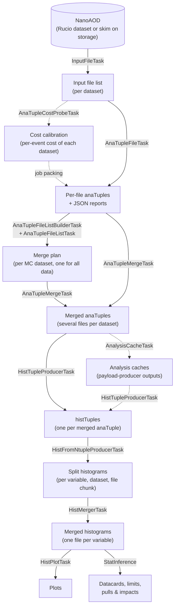

# Data flow

This page follows the data through the pipeline: what each stage consumes, what it produces, and
how the products feed the next stage. It is the conceptual companion to the hands-on
[walkthrough](../workflow/walkthrough.md).

## The pipeline at a glance

Boxes are data products, arrows are the tasks that make them. Dashed arrows are the
analysis-cache path, which runs only when the analysis needs it (see
[below](#payload-producers-and-the-analysis-cache)).

```mermaid
flowchart TD
    NANO[("NanoAOD<br/>(Rucio dataset or skim on storage)")]
    LIST["Input file list<br/>(per dataset)"]
    COST["Cost calibration<br/>(per-event cost of each dataset)"]
    SPLIT["Per-file anaTuples<br/>+ JSON reports"]
    PLAN["Merge plan<br/>(per MC dataset, one for all data)"]
    ANA["Merged anaTuples<br/>(several files per dataset)"]
    CACHE["Analysis caches<br/>(payload-producer outputs)"]
    HTUP["histTuples<br/>(one per merged anaTuple)"]
    HSPLIT["Split histograms<br/>(per variable, dataset, file chunk)"]
    HIST["Merged histograms<br/>(one file per variable)"]
    PLOT[Plots]
    STAT["Datacards, limits,<br/>pulls & impacts"]

    NANO -->|InputFileTask| LIST
    LIST -.->|AnaTupleCostProbeTask| COST
    COST -.->|job packing| SPLIT
    LIST -->|AnaTupleFileTask| SPLIT
    SPLIT -->|"AnaTupleFileListBuilderTask<br/>+ AnaTupleFileListTask"| PLAN
    PLAN -->|AnaTupleMergeTask| ANA
    SPLIT -->|AnaTupleMergeTask| ANA
    ANA -.->|AnalysisCacheTask| CACHE
    ANA -->|HistTupleProducerTask| HTUP
    CACHE -.->|HistTupleProducerTask| HTUP
    HTUP -->|HistFromNtupleProducerTask| HSPLIT
    HSPLIT -->|HistMergerTask| HIST
    HIST -->|HistPlotTask| PLOT
    HIST -->|StatInference| STAT
```

## Stage by stage

| Stage (task) | Consumes | Produces |
|---|---|---|
| **InputFileTask** | The era's dataset list. | One JSON **file list** per dataset (one branch per dataset). The files come from a directory listing of the dataset's storage — the HLepRare skims on the era's `fs_nanoAOD`, or a dataset's own `fs_nanoAOD` — or, for a NanoAOD version given by DAS name, from **Rucio**. Runs locally and cheaply; everything else keys off it. |
| **AnaTupleCostProbeTask** | One input file per dataset. | A per-event cost measurement that decides how `AnaTupleFileTask` branches are packed into jobs. Optional (`anaTuple_scheduling.probe_enabled`). |
| **AnaTupleFileTask** | One NanoAOD file (one branch per file). | One per-file **anaTuple** plus a JSON report: a slimmed/skimmed ntuple with the objects, weights and flags the analysis needs. Runs `AnaProd/anaTupleProducer.py` in the FLAF environment, or inside CMSSW when the analysis sets `use_cmssw_env_AnaTupleProduction: true` (HH→bb̄ττ does). |
| **AnaTupleFileListBuilderTask** | The reports of all per-file anaTuples of a dataset. | The **merge plan**: which per-file anaTuples go into which merged file. One branch per MC dataset and a single branch `data` for all data datasets. `AnaTupleFileListTask` copies the plan to the local `data/` area. |
| **AnaTupleMergeTask** | The per-file anaTuples of one plan item. | Merged anaTuples of about `nEventsPerFile` events each (`anaTuple_<N>.root`), so a dataset usually has several. All data datasets become one sample, `data`, with duplicate events removed. MC normalisation happens here (`weight_base`, plus `weight_base_cmb` in the 2024+ shared-MC eras). |
| **AnalysisCacheTask** | One merged anaTuple file (+ the caches of the producers it depends on). | The output of one **payload producer** (e.g. a DNN score) for every event of that file. Only when needed — see [below](#payload-producers-and-the-analysis-cache). |
| **HistTupleProducerTask** | One merged anaTuple file + its analysis caches. | One **histTuple**: the analysis variables defined by the analysis's `histTupleDef`, the final event weights and the binned columns the histogram step reads. Payload-producer columns are read in from the caches. |
| **HistFromNtupleProducerTask** | A chunk of the histTuples of one dataset. | **Histograms** of every active variable for that chunk. Branches over (dataset, file chunk), `--n-files-per-job` files each. Up/Down variations only when `compute_unc_histograms` is true. |
| **HistMergerTask** | The split histograms of one variable. | One merged file per variable with the histograms per process, ready for plotting and fitting. One branch per variable. |
| **HistPlotTask** | Merged histograms. | **Plots** (one branch per variable). |
| **Statistical inference** | Merged histograms. | Datacards, exclusion limits, pulls & impacts (via `StatInference` and the `inference`/`dhi` Combine tooling). See the [task reference](../reference/tasks.md#statistical-inference-tasks). |

!!! note "Systematic variations are opt-in"
    Variations are only produced when asked for. At the anaTuple stage, `compute_unc_variations`
    enables the weight variations and the shifted trees (the shifted trees also need
    `store_noncentral`); both default to `false`. At the histogram stages,
    `compute_unc_histograms` (read from the histTuple flavour first, then `global.yaml` /
    `user_custom.yaml`; default `false`) turns on the Up/Down histograms. The CI sets all three
    in each analysis's `config/ci_custom.yaml`.

## How the anaTuples are merged

The merge is where one production turns into a dataset-level sample:

- **Merge plan.** `AnaTupleFileListBuilderTask` reads the reports of all per-file anaTuples,
  skips files marked invalid (an empty or corrupted NanoAOD file gives an empty anaTuple with an
  invalid report) and, for MC, the fewest events' worth of files needed so that no luminosity
  block appears in two files, and groups the rest into outputs of about `nEventsPerFile` events (per process group in `global.yaml`; FLAF's
  default is 1 000 000 for data and 100 000 otherwise). Each plan item is one
  `AnaTupleMergeTask` branch.
- **Data.** All data datasets of the era are merged together into the sample `data` (outputs
  are still kept apart per era letter), with duplicate events (same run, luminosity block and
  event number) removed.
- **MC.** The normalisation weight `weight_base` is computed at the merge, because only then are
  the denominators of the whole dataset known (they are combined from the reports of all its
  files). For a process whose processor declares `dependency_level: {AnaTupleMerge: process}`
  — as most stitchers in the analyses' `processes.yaml` do — the reports of all of the process's datasets are combined
  instead; see [MC stitching](stitching.md).
- **Dropping columns.** Regular expressions in `anaTupleMerge_drop_columns` remove columns that
  are needed as merge inputs but not afterwards.

## Payload producers and the analysis cache

A **payload producer** is an analysis-defined module — typically a neural network — listed under
`payload_producers` in `global.yaml`, which delivers the columns named in its `columns` list. All
three analyses define some (HH→bb̄ττ: `ggF_DNN`; H→μμ: `DNN`, `VBFNet`, `PostVBFNetDNN`;
HH→bb̄WW: `SingleLepHME`, `DoubleLepHME`, `DNN`, `TwoStageDNN`, `DeepHME` and `BtagShape`).

Producers do not run inside `HistTupleProducerTask`. Each one runs in its own
**`AnalysisCacheTask`** (`--producer-to-run <name>`), one branch per merged anaTuple file, and
writes a cache file that `HistTupleProducerTask` then reads alongside the anaTuple. The task
graph includes it automatically whenever a histTuple variable is one of its columns, named
`<producer>_<column>` (for example `ggF_DNN_HH` or `DNN_NNOutput`), so whether it runs depends on
the variables of the active histTuple flavour. A producer can depend on other producers
(`dependencies`); their caches are produced first.

A producer marked `is_global` and `needs_aggregation` that a correction names as its
`normCacheProducer` — today HH→bb̄WW's `BtagShape`, whose per-file sums become the b-tag shape
normalisation correction — is additionally combined per dataset by
**`AnalysisCacheAggregationTask`**, and the aggregated file is passed to every histTuple job of
that dataset. See the [Task reference](../reference/tasks.md#analysiscachetask).

!!! tip "Freeing space: removable intermediates"
    The per-chunk split histograms `HistFromNtupleProducerTask` writes are only needed until they
    are merged. Set `remove_merged_inputs: true` (see
    [user_custom](../configuration/user-custom.md)) to have `HistMergerTask` delete each split
    after merging and drop a tiny per-chunk `.merged` marker next to it. The producer still reports
    **complete** for exactly the chunks that were merged (it finds the split *or* its marker), so
    the task graph stays consistent and nothing re-runs — while a chunk that was never produced
    (e.g. after adding a dataset or changing `n_files_per_job`) has no marker and is still produced
    normally.

## Where the outputs live

Each output type is written to a **named filesystem** (`fs_*`) that you configure — typically
grid/EOS storage for the big ntuples and histograms, and a local `data/` area for small
artifacts. The mapping and how to set it is covered in [Storage & filesystems](storage.md) and
the [`user_custom.yaml` guide](../configuration/user-custom.md). The practical consequence:

- Large products (anaTuples, histTuples, histograms) persist on shared storage, so collaborators
  — and the next stage — can reuse them without recomputing.
- Because LAW skips tasks whose output already exists, **the pipeline is incremental**: re-running
  a late stage only computes what is genuinely missing.

## Versions keep productions apart

Every output path includes the `--version` you chose. Two runs with different versions never
collide, which is how parallel productions, personal tests and official productions coexist on the
same storage. The per-task `--<TaskName>-version` overrides let one run *read* an existing
upstream production while *writing* its own downstream outputs under a new version — see
[Command arguments](../workflow/arguments.md#per-task-version-overrides).
