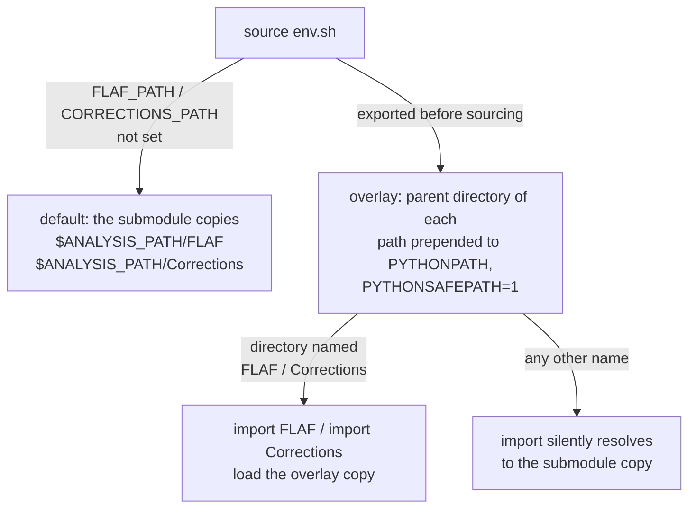

# The environment

`source env.sh` (from an analysis checkout) builds and activates everything FLAF needs. This page
explains what that environment contains, the variables it sets, and the few sharp edges to avoid.

## What `env.sh` sets up

The analysis `env.sh` sets `ANALYSIS_PATH` (and, for the HH analyses, `HH_INFERENCE_PATH`),
defaults `FLAF_PATH` to its `FLAF/` submodule, then hands off to `FLAF/env.sh`, which:

1. **Activates `flaf_env`** — a Python virtual environment built from the CVMFS `LCG_110a` stack
   (`x86_64-el9-gcc15-opt`), under `soft/flaf_env`. This provides Python, ROOT and the FLAF
   dependencies, at the versions pinned in `run_tools/mk_flaf_env.sh`, and registers the `law`
   command with tab-completion.
2. **Provides CMSSW** — installs/uses `CMSSW_16_0_6` (compiler `gcc13`) under `soft/`. Most of
   the pipeline runs in `flaf_env`; CMSSW is used only where the configuration asks for it:
   AnaTuple production when `use_cmssw_env_AnaTupleProduction: true` (set by HH_bbtautau only —
   HH_bbWW and H_mumu produce their anaTuples in `flaf_env`), and payload producers that set
   `cmssw_env: True` (HH_bbWW's HME producers), and the CMSSW steps of the StatInference chain
   (`PreprocessShapesTask`, `CreateDatacardsTask`, `ResonantLimitsTask`), which switch into it themselves.
3. **Provides Combine** — builds
   [Combine](https://cms-analysis.github.io/HiggsAnalysis-CombinedLimit/) `v11.1.0`
   (`FLAF_COMBINE_VERSION`) twice: in the CMSSW area (`src/HiggsAnalysis/CombinedLimit`, together
   with CombineHarvester), used by the tasks that run in CMSSW and by jobs that run from bundles,
   and standalone in `soft/HiggsAnalysis-CombinedLimit`, against the ROOT of `flaf_env`, for the
   `inference`/`dhi` tooling that it also wires up for HH analyses. The standalone build carries one
   FLAF patch (`run_tools/combine_root638_clipping.patch`): since ROOT 6.38 `RooRealVar::setVal`
   throws outside the variable's range instead of clipping, which makes Combine's
   `AsymptoticLimits` abort on the observed limit while still exiting 0, and the patch restores
   the clipping Combine relies on. Both builds record the version they were made for; when it
   changes, the next `source env.sh` checks out the new version in the CMSSW area and rebuilds it
   with `scram`, and rebuilds the standalone one. The `dhi` setup, `inference/.setups/flaf.sh`, is
   written again at the same time, so edits made to it by hand do not survive a version change.
4. **Sets up grid access** — points `X509_USER_PROXY` at `data/voms.proxy` (unless it is already
   set) and initialises Rucio, pinned to the version in `FLAF_RUCIO_VERSION` (default `39.2.0`).
5. **Defines the `cmsEnv` helper** (see below).

!!! note "First source is slow, the rest are fast"
    The CMSSW and Combine builds happen only on the first `source env.sh`. After that it is a
    quick activation. You must source it **once in every new shell**.

!!! warning "When FLAF moves to another LCG release"
    The LCG release is pinned in `FLAF/env.sh`. The first `source env.sh` after an update of
    FLAF that changes it deletes and rebuilds `soft/flaf_env` and rebuilds the standalone Combine,
    which links against the ROOT of `flaf_env` (the same happens to both Combine builds when
    `FLAF_COMBINE_VERSION` changes). Run it in a fresh shell, with network access, and
    not in a checkout whose jobs are still queued or running: they use the same `soft/`. A
    production that reuses an existing `--version` with bundles also needs its unhashed `cmssw`
    bundle deleted, see
    [Bundles are named after what they contain](../workflow/htcondor.md#bundles-are-named-after-what-they-contain)
    (the `soft` bundle is named after the environment it packs, so a rebuilt `flaf_env` gets a new
    one by itself); with an old `cmssw` bundle the jobs stop with
    `ERROR: …/.installed_combine_v11.1.0 not found and FLAF_NO_INSTALL=1`. `LCG_110a` brings Python 3.13
    and ROOT 6.40, which matters for personal scripts run in `flaf_env`. The standalone Combine
    that earlier versions built inside the CMSSW area
    (`soft/CMSSW_16_0_6/src/HiggsAnalysis/CombinedLimit/build`) is removed on the way.

!!! warning "`run_tools/mk_flaf_env.sh` defines `flaf_env`"
    Every package that `run_tools/mk_flaf_env.sh` installs on top of the LCG view is pinned there
    (`==`, or the archive of one commit), law and luigi among them; what those packages pull in
    is not pinned (there is no lock file). `FLAF/env.sh` names no package: it identifies the
    environment by the LCG release and a hash of that script, exported as `FLAF_ENVIRONMENT_ID`
    (`LCG_110a_x86_64-el9-gcc15-opt_<12 hex digits>`), and marks a built `flaf_env` with it
    (`soft/flaf_env/.<FLAF_ENVIRONMENT_ID>`), once the whole build has succeeded. Any change to the
    script, a moved pin included, changes the identity, so the next `source env.sh` deletes and
    rebuilds `soft/flaf_env`, as for a new LCG release above: with network access, and not in a
    checkout whose jobs are queued or running.

    This happens on the submitting machine only. Inside a law batch job (law sets
    `LAW_JOB_HOME` there, so a non-bundle HTCondor job that sources `env.sh` from AFS counts as
    well) and with `FLAF_NO_INSTALL=1` (bundle jobs), an environment without the current marker
    stops `env.sh` with `ERROR: … was not built by the current …/mk_flaf_env.sh (no marker .…),
    and nothing is built from a law batch job or with FLAF_NO_INSTALL=1. Source env.sh on the
    submitting machine, which rebuilds it, and resubmit.`, so no worker removes or writes an
    environment that other jobs run from. Whether `soft/flaf_env` exists, and whether its marker
    is missing, is taken from listings of `soft/` and of `soft/flaf_env`, never from a stat alone.
    A check that cannot be made (the script cannot be hashed, a listing fails, or a listing and a
    stat disagree: `soft/flaf_env` is listed but not seen as a directory, or seen but not listed,
    or the marker is listed but not seen) stops `env.sh` with
    `ERROR: cannot identify the FLAF environment: …` or `ERROR: cannot tell whether …`, and
    nothing is removed or built.

    The bundle that packs `flaf_env` is named after the identity
    (`soft_<FLAF_ENVIRONMENT_ID>.tar.bz2`), so the first submission after a rebuild packs it anew,
    also for an existing `--version`. Nothing checks the versions outside `flaf_env`: FLAF does not
    when it is imported, so an environment of your own needs the same pins.

## Key environment variables

| Variable | Meaning |
|---|---|
| `ANALYSIS_PATH` | The analysis checkout (set by the analysis `env.sh`). |
| `FLAF_PATH` | The FLAF code in use. Defaults to `$ANALYSIS_PATH/FLAF`; override to develop FLAF (below). |
| `CORRECTIONS_PATH` | The Corrections code in use. Defaults to `$ANALYSIS_PATH/Corrections`. |
| `ANALYSIS_SOFT_PATH` | Where the built software lives (`$ANALYSIS_PATH/soft`). |
| `FLAF_ENVIRONMENT_PATH` | The `flaf_env` virtual environment (`$ANALYSIS_SOFT_PATH/flaf_env`). |
| `FLAF_ENVIRONMENT_ID` | Set by `env.sh`: the identity of `flaf_env`, the LCG release and a hash of `run_tools/mk_flaf_env.sh`. It names the environment's marker and the bundle that packs it. |
| `FLAF_CMSSW_BASE` | The CMSSW area used by the pipeline. |
| `FLAF_COMBINE_PATH` | The standalone Combine checkout (`soft/HiggsAnalysis-CombinedLimit`); its build is put on `PATH` (`build/bin`), `LD_LIBRARY_PATH` and `PYTHONPATH`. |
| `FLAF_COMBINE_VERSION` | The Combine version of both builds (CMSSW area and standalone); `none` switches Combine off. |
| `ANALYSIS_DATA_PATH` | The local `data/` working area. |
| `X509_USER_PROXY` | Your VOMS proxy (default `data/voms.proxy`; a value set before sourcing is kept). |
| `LAW_HOME` / `LAW_CONFIG_FILE` | LAW's home (`.law`) and config (`config/law.cfg`). |
| `FLAF_NO_INSTALL` | When `1`, `env.sh` refuses to build or change anything (a `flaf_env` without the marker of the current `run_tools/mk_flaf_env.sh` included) and skips CMSSW/Combine entirely if no CMSSW area is present. Set by the bootstrap of bundle jobs, which have a CMSSW area only when the `cmssw` flavour is shipped. |

## `cmsEnv`: running inside CMSSW

Some commands must run inside the CMSSW runtime. The `cmsEnv` alias runs a command in a clean
shell with just the CMSSW variables set:

```sh
cmsEnv python3 my_cmssw_script.py
cmsEnv /bin/zsh         # an interactive CMSSW subshell
```

You will see it most often around statistical-inference commands that call `combine`.

## Developing shared submodules

`FLAF` and `Corrections` are pinned **submodules** inside the analysis. If you edit the framework
in place and run the pipeline, your edits may be ignored — because the run uses the submodule copy.
The environment solves this cleanly: `FLAF_PATH` and `CORRECTIONS_PATH` are **inputs** to
`env.sh`. If they are already set when you source it, they are respected; otherwise they default to
the submodule copies.

So to run against an edited copy of FLAF, set `FLAF_PATH` to that copy **before** sourcing:

```sh
export FLAF_PATH=/path/to/your/edited/FLAF
source env.sh           # everything downstream now uses the edited FLAF
```

Everything derived from it — `PYTHONPATH`, the code shipped in batch bundles, the worker bootstrap
— follows automatically. When `FLAF_PATH`/`CORRECTIONS_PATH` differ from the submodule copy,
`env.sh` also enables `PYTHONSAFEPATH` and prepends the **parent directory** of each to
`PYTHONPATH`, so the edited copy wins for `import FLAF` / `import Corrections` (which are
namespace packages). On HTCondor, non-bundle jobs receive these paths (the AFS area is mounted on
workers); bundle jobs ship the edited code inside the tarball instead. See
[Running on HTCondor](../workflow/htcondor.md) and [Contributing](../contributing.md).



!!! warning "The overlay directory must be called `FLAF` (or `Corrections`)"
    Only the parent of `FLAF_PATH` is put on `PYTHONPATH`, so Python finds the overlay only if
    the directory itself is named `FLAF` (`Corrections` for `CORRECTIONS_PATH`). With
    `FLAF_PATH=/path/to/FLAF_dev`, `import FLAF` still loads `$ANALYSIS_PATH/FLAF` (or a
    `/path/to/FLAF`, if one exists) without any warning, while bundles pack `/path/to/FLAF_dev`.

!!! warning "Configuration is always read from the submodule"
    The configuration loader (`Common/Setup.py`) reads the framework configuration from
    `$ANALYSIS_PATH/FLAF/config`, whatever `FLAF_PATH` says. Edits to `config/` in an overlay are
    therefore ignored on the submit host and in non-bundle jobs, but bundles pack `FLAF` from
    `FLAF_PATH`, so bundle jobs read the overlay's configuration. Make configuration edits in the
    submodule copy, or keep the two in sync.

!!! warning "`flaf_env` follows the overlay's installation script"
    `flaf_env` is identified by the `run_tools/mk_flaf_env.sh` of `FLAF_PATH`. When the overlay
    and the submodule copy differ there (an overlay with a moved pin, say), every `source env.sh`
    that switches between the two deletes and rebuilds `soft/flaf_env`.

## Sharp edges

!!! danger "Do not strip `LD_LIBRARY_PATH` (`env -i`)"
    Running the environment under `env -i` (a fully empty environment) removes `LD_LIBRARY_PATH`,
    which ROOT/cling needs — you get cryptic library/JIT failures. If you must launch a clean
    background shell, preserve `LD_LIBRARY_PATH` (and `HOME`, `PATH`).

!!! danger "Source the file, not its text"
    `env.sh` locates itself through the path it was sourced from (`BASH_SOURCE` in bash, `%x` in
    zsh). Running its text instead — `eval "$(cat env.sh)"`, piping it into a shell — breaks that
    detection and sets the wrong `ANALYSIS_PATH`. `bash -c "source env.sh; …"` locates it
    correctly, but the settings last only for that command. Source it directly in your shell, or
    put the commands in a script file that sources it and run that script.

!!! warning "One environment per shell — beware cross-analysis contamination"
    The environment caches paths in variables (`FLAF_PATH`, `ANALYSIS_SOFT_PATH`, …). Sourcing a
    *second* analysis's `env.sh` in the same shell, or reusing a shell that already has another
    analysis's variables, can pick up the wrong `flaf_env`. Use a fresh shell per analysis. When
    scripting background runs, unset the `FLAF_*`/`ANALYSIS_*` variables first (see
    [Troubleshooting](../troubleshooting.md#cross-analysis-environment-contamination)).
