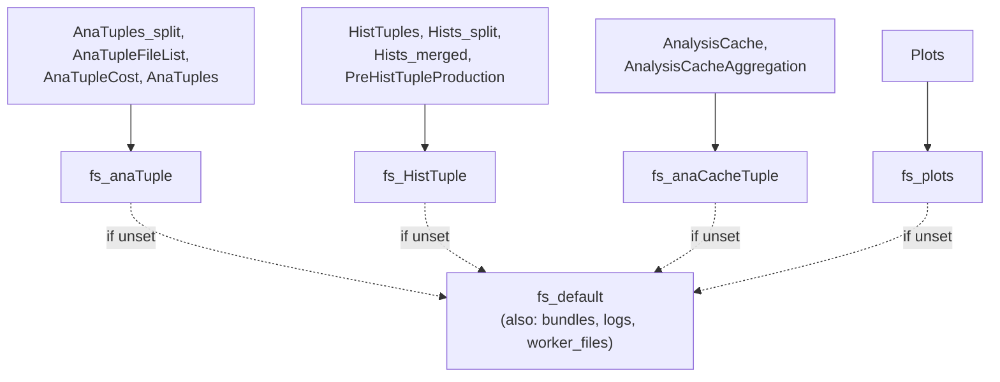
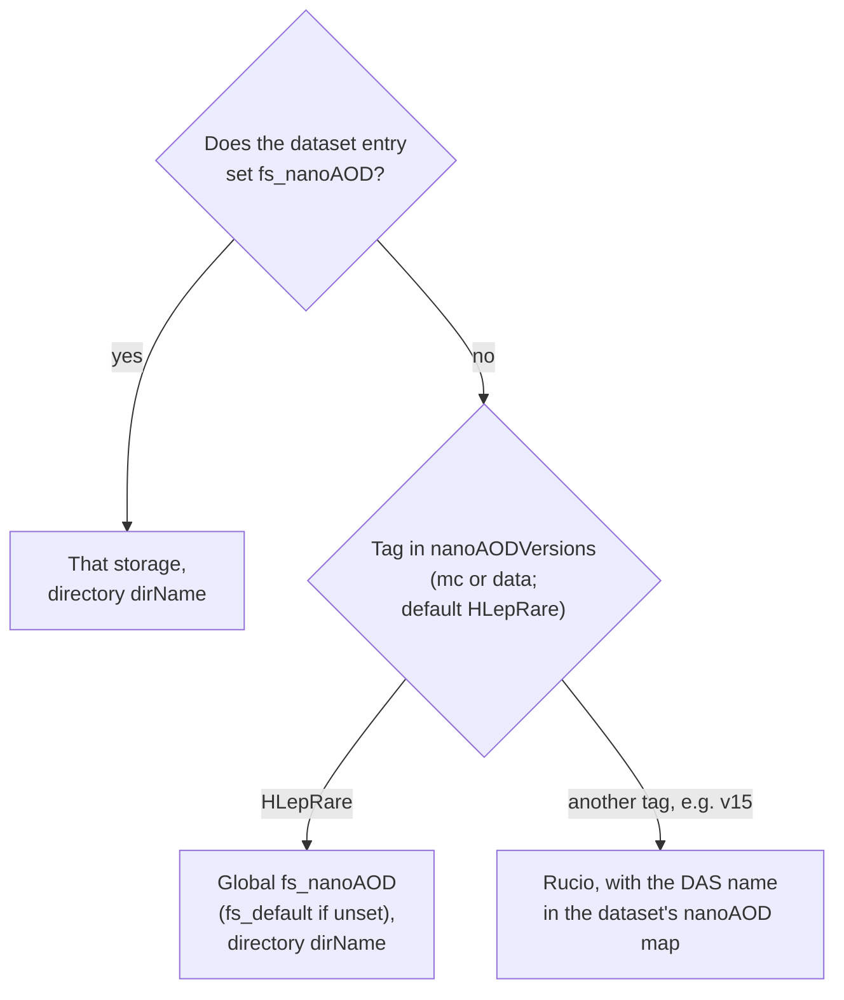

# Storage & filesystems

FLAF reads CMS data from the grid and writes large outputs (ntuples, histograms) to grid/EOS
storage, while keeping small artifacts locally. It abstracts every location behind a **named
filesystem** — a `fs_*` key, normally set in [`user_custom.yaml`](../configuration/user-custom.md).

## Named filesystems (`fs_*`)

Each output type has a filesystem name. You only have to set `fs_default`; the others fall back to
it when unset, so a one-line configuration is enough to get going.

| Key | Used for |
|---|---|
| `fs_default` | The fallback for every key below. **The one key you must set** — a task fails with *No default file system defined* without it. It also directly holds the code bundles, the staged job logs and the bundle jobs' worker files. |
| `fs_anaTuple` | Everything of the AnaTuple production: the per-input-file anaTuples and their reports, the merge plans and reports of `AnaTupleFileListBuilderTask`, the cost probes of `AnaTupleCostProbeTask`, and the merged anaTuples. |
| `fs_HistTuple` | histTuples (ntuples with analysis observables), the per-chunk and the merged **histograms**, and the `PreHistTupleProductionTask` markers. |
| `fs_anaCacheTuple` | The analysis caches (`AnalysisCacheTask`) and their aggregations (`AnalysisCacheAggregationTask`). |
| `fs_plots` | Plot outputs (`HistPlotTask`). |
| `fs_nanoAOD` | An **input** location: where NanoAOD is read from for datasets that are not taken from Rucio — see [Where the inputs come from](#where-the-inputs-come-from). |
| `fs_histograms`, `fs_anaCache`, `fs_nnCacheTuple` | Resolved like the others, but no FLAF task writes to them. `fs_histograms` is used by some analysis studies (e.g. the HH→bb̄WW DNN tasks). |

Official datasets are not reached through a `fs_*` key: FLAF resolves them with a built-in
Rucio filesystem, and there is no `fs_rucio` setting.



!!! tip "Start with just `fs_default`"
    Set `fs_default` to your personal storage and leave the rest unset. Everything then lands in
    one place, namespaced by `--version` and era. Split outputs across sites later, when you need
    to (e.g. point `fs_anaTuple` at a Tier-2/Tier-3 with lots of space).

## How outputs are laid out

Under each filesystem, a product is stored as `<version>/<ProductDir>/…`, in most cases followed
by the period (paths below are relative to `<version>/`):

| Product directory | Written by | Filesystem |
|---|---|---|
| `AnaTuples_split/<period>/<dataset>/` | `AnaTupleFileTask` (`anaTupleFile_<i>.root` + a `.json` report per input file) | `fs_anaTuple` |
| `AnaTupleFileList/<period>/`, `AnaTupleFileList_reports/<period>/` | `AnaTupleFileListBuilderTask` (merge plan and reports, one JSON per dataset) | `fs_anaTuple` |
| `AnaTupleCost/<nano version>/` | `AnaTupleCostProbeTask` (no period: probes are shared by the eras) | `fs_anaTuple` |
| `AnaTuples/<period>/<dataset>/` | `AnaTupleMergeTask` | `fs_anaTuple` |
| `HistTuples/<period>/<dataset>/` | `HistTupleProducerTask` | `fs_HistTuple` |
| `Hists_split/<period>/<variable>/<dataset>/` | `HistFromNtupleProducerTask` | `fs_HistTuple` |
| `Hists_merged/<period>/<variable>/` | `HistMergerTask` | `fs_HistTuple` |
| `PreHistTupleProduction/<period>/<dataset>/` | `PreHistTupleProductionTask` (one `.done` marker per anaTuple file) | `fs_HistTuple` |
| `AnalysisCache/<producer>/<period>/`, `AnalysisCacheAggregation/<producer>/<period>/` | `AnalysisCacheTask`, `AnalysisCacheAggregationTask` | `fs_anaCacheTuple` |
| `Plots/<period>/<variable>/…` | `HistPlotTask` | `fs_plots` |
| `bundles/<period>/` | `BundleTask` (`<flavour>.tar.bz2`, or `<flavour>_<hash>.tar.bz2` for a flavour with `hashed: true`) | `fs_default` |
| `logs/<Task>/<period>/` | job logs staged by remote jobs (only for a remote `fs_default`) | `fs_default` |
| `worker_files/<period>/` | input files of bundle HTCondor jobs, uploaded at submission — only when `htcondor_spool` (on by default) is turned off | `fs_default` |

Bundle naming matters when something they pack changes: only flavours with `hashed: true` (in
the analyses: `core`) get a new name, and an existing unhashed bundle (e.g. `soft`, `cmssw`) is
never rebuilt — delete it to force a rebuild. See
[Bundles](../workflow/htcondor.md#bundles-are-named-after-what-they-contain).

## How to write a location

A filesystem value is a storage URL (or a list of them). Two common forms:

```yaml
# EOS via WebDAV (your CERNBox / EOS user area):
fs_default: davs://eoshome-k.cern.ch:8444/eos/user/k/kandroso/FLAF/HH_bbtautau/

# A WLCG site (Tier-3/Tier-2) by its name + logical path:
fs_anaTuple: T3_CH_CERNBOX:/store/user/<user>/HH_bbtautau/
```

- `davs://…` is a direct WebDAV endpoint (good for your EOS user area).
- `T3_CH_CERNBOX:/store/...` names a registered WLCG site and a logical path under it; FLAF
  resolves it to a physical URL through Rucio and caches the result (see
  [Troubleshooting](../troubleshooting.md#a-run-unexpectedly-drops-into-inputfiletask-rucio-errors)).
  `T3_CH_CERNBOX` (CERNBox) and `T3_US_FNALLPC` (FNAL LPC) are common choices.
- A **local absolute path** (e.g. `/builds/.../output/HH_bbtautau`) is also valid — CI uses one so
  its outputs stay on the runner. Bundle jobs and [`--workflow crab`](../workflow/crab.md) refuse a
  local `fs_default`: they need a remote one.

A value may also be a **list**. The first entry decides whether it is a local or a remote
filesystem. For a local path only that first entry is used; for remote entries every write goes
to **all** of them (mirrors), a read tries them in order until one copy succeeds, and an
existence check or a directory listing asks a single entry, picked at random.

## Where the inputs come from

The NanoAOD source is chosen per dataset, when `InputFileTask` lists its files:



- `dirName` defaults to the dataset name.
- `nanoAODVersions` is a global setting with a `data` and an `mc` tag. When an era does not set
  it, the tag is `HLepRare` and the files are read from the global `fs_nanoAOD`. FLAF sets that
  key for `Run3_2022` … `Run3_2023BPix` to the HLepRare skims
  (`T2_CH_CERN:/store/group/phys_higgs/HLepRare/skim_2025_v1/<era>`), so an analysis that does not
  set `nanoAODVersions` for those eras (HH→bb̄ττ) reads the skims, not the central NanoAOD.
- Any other tag selects the Rucio path: the dataset's `nanoAOD` entry for that tag is the DAS name.
  A dataset without an entry for the tag fails with *Unable to identify the file source*.
- A per-dataset `fs_nanoAOD` is the way to read a **custom** sample from your own storage (see
  [Datasets](../configuration/datasets.md)).

A job that reads a Rucio file copies it to its working directory first (`RunKit/grid_tools.py`,
`copy_remote_file`). It asks Rucio for the disk replicas with their size and adler32 and tries
the nearest site first (sites at the same distance in random order), one endpoint per site before
a second endpoint of a site already tried, and the CMS xrootd federation
(`cms-xrd-global.cern.ch`) after every site:

- each attempt is a single `xrdcp`/`gfal-copy`. It is stopped when it fails, when no data has
  arrived for 5 min, or at a time limit that follows the file size (5 min, or the time the file
  takes at 1 MB/s if that is longer); the next replica is then tried at once;
- an attempt still running after the time the file should take (1 min plus the time at 10 MB/s)
  is joined by one on the next replica, unless data keeps arriving at a rate that brings the
  rest of the file within that time again; at most two copies run at once, the first copy with
  the size and adler32 recorded in Rucio wins, and the other one is stopped;
- every replica is tried up to three more times, 10, 20 and 30 s after its previous attempt
  ended, each time with three times longer limits except the 5 min without data (at most 4 h
  per attempt), so a slow but working connection still gets through; the copy gives up after
  6 h in total;
- a site that failed, or was overtaken after its expected time, is tried after the others for
  the rest of the job (a job copies the input files of all its branches).

So a site that accepts connections but never delivers delays a copy by the time the file should
take (about a minute for a small file), not hours.

## Local working area: `data/`

Independently of the `fs_*` storage, each analysis checkout has a `data/` directory
(`$ANALYSIS_DATA_PATH`, default `<analysis>/data`) used for:

- your **VOMS proxy** (`data/voms.proxy`, where `X509_USER_PROXY` points by default),
- LAW job files (`data/jobs/`),
- small local outputs under `data/<version>/<Task>/<period>/` — e.g. the input file lists of
  `InputFileTask` and the per-dataset copies of `AnaTupleFileListTask` — and the AnaTuple cost
  model (`data/<version>/AnaTupleCost/cost_model.json`).

This lives in your AFS checkout, not on grid storage.

## The VOMS proxy is your storage key

All grid/EOS access uses your **VOMS proxy**. If it expires, reads and writes to `fs_*` locations
fail — often with confusing "permission denied" or "file not found" messages. Refresh it with
`voms-proxy-init -voms cms -rfc -valid 192:00` (see [Installation](../getting-started/installation.md)).

## A caveat worth knowing: read-after-write lag on EOS

EOS is eventually consistent. A file you just **wrote** can be briefly **invisible** to a
subsequent existence check (seconds, occasionally longer). FLAF tolerates this in normal
operation, but if you script your own existence checks against freshly written outputs, probe with
a directory listing and a short retry rather than a single `exists()`. See
[Troubleshooting](../troubleshooting.md#eos-read-after-write-lag).

## Keeping I/O off shared production areas

When testing, point `fs_default` at *your own* area (and use a personal `--version`) so you never
write into a shared production path. The CI does the inverse — it points `fs_default` at the local
runner so a test never touches real storage at all.
