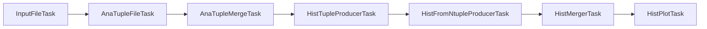

# Tasks & LAW

FLAF expresses the whole analysis as a set of **tasks** wired together by their dependencies, and
runs them with [LAW](https://github.com/riga/law) (on top of
[Luigi](https://luigi.readthedocs.io/)). You do not need to know Luigi to use FLAF, but a working
mental model of "tasks" pays off immediately.

## What is a task?

A **task** is one stage of work with three things defined:

- **outputs** — the file(s) it produces (`output()`),
- **requirements** — the other tasks it depends on (`requires()`),
- a **run** step — what it actually does to turn inputs into outputs.

The crucial property: **a task that already has its output is considered done.** LAW checks for
the output file; if it exists, the task is skipped. This makes the pipeline *resumable* — re-run a
late stage and only the missing upstream pieces are computed.

## You request the end; LAW fills in the middle

You almost never run the intermediate stages by hand. You ask for the task whose result you want,
and LAW walks the dependency graph and runs whatever is missing, in order:

```sh
law run FLAF.Analysis.tasks.HistPlotTask --version v1 --period Run3_2022
```

Even though plotting is the *last* stage, this single command will (if needed) resolve input
files, produce and merge ntuples, compute observables and fill histograms first. The dependency
graph for the analysis is, in order:



Every box is documented in the [Task reference](../reference/tasks.md), and the same chain is
walked through with commands in the [full-workflow walkthrough](../workflow/walkthrough.md).

## Workflows and branches

Most FLAF tasks are **workflows**: they split into many independent **branches** that can run in
parallel. What a branch *is* depends on the task:

- `AnaTupleFileTask` has **one branch per input NanoAOD file**.
- `HistPlotTask` has **one branch per variable** to plot.
- merge tasks have one branch per dataset/process.

Two arguments control workflows:

- `--workflow local` runs branches on the current machine; `--workflow htcondor` submits them to
  the [batch system](../workflow/htcondor.md).
- `--branches 0,2,5-7` runs only selected branches (great for testing one file or one variable).

!!! tip "`--branches 0` does not mean 'a tiny run of everything'"
    `--branches` only restricts the *task you launched*. Its upstream dependencies still run for
    everything they need. For example `HistPlotTask --branches 0` plots one variable, but the
    ntuples and histograms it needs are still produced for all datasets. To make a run genuinely
    small, combine it with `--test` (few events) and `phys_model: TestModel` (few processes).

## Inspecting and cleaning up

LAW gives you commands to see and manage the state of the graph without running it:

| Command | What it does |
|---|---|
| `--print-status N,K` | Show the status of the dependency tree to *task depth* `N` and *file-collection depth* `K`. `--print-status 3,1` is a good default. The output also reveals each output's path. |
| `--print-deps N` | Print the dependency tree to depth `N` without checking outputs. |
| `--remove-output N,a,y` | Remove this task's outputs to depth `N`. `a` = all branches, `y` = no confirmation. Use to force a redo. |
| `--parallel-jobs M` | Cap the number of branches running at once (e.g. `--parallel-jobs 100`). Strongly recommended for large local or batch runs. |

!!! warning "`--remove-output` deletes files"
    It removes real outputs (including on grid storage). Double-check the depth and the version
    before confirming, especially in a shared production area.

## Where do the common options come from?

`--version`, `--period`, `--workflow`, `--branches`, `--test`, `--customisations`, `--process`,
`--user-custom` and the per-task `--*-version` overrides are defined on FLAF's base task classes
(in `FLAF/run_tools/law_customizations.py`), so they are available on **every** FLAF task. They
are all catalogued in [Command arguments](../workflow/arguments.md).

## When to re-index

LAW maintains an index of available tasks. Re-run `law index --verbose` after you **add, rename
or move** a task class, or you will get "task not found" errors. Simply editing the body of an
existing task does not require re-indexing.
