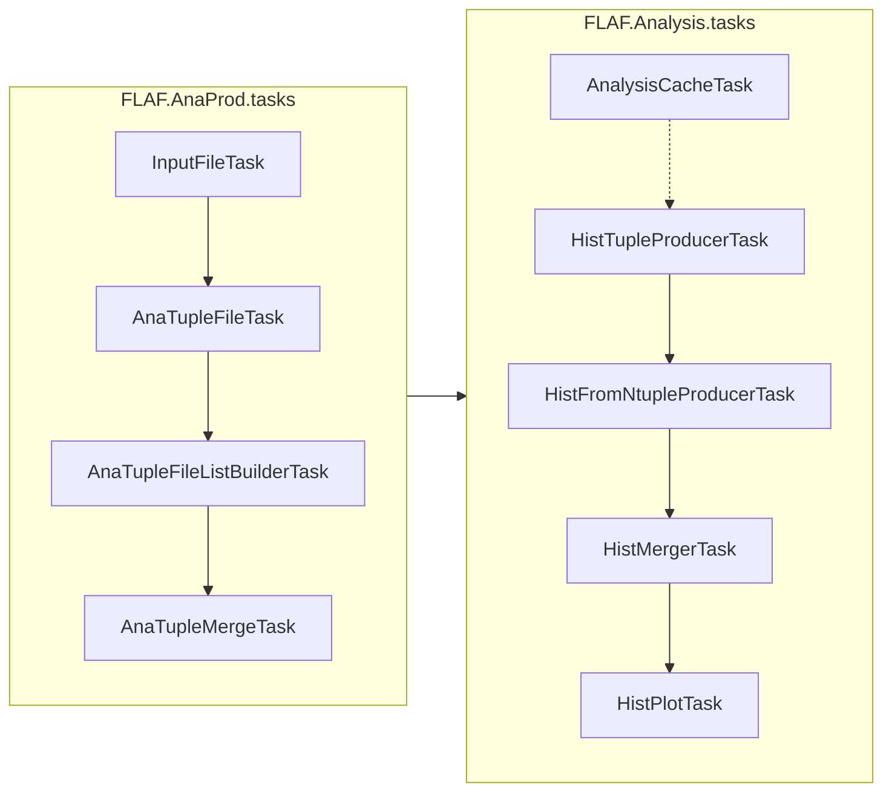

# Tasks & LAW

FLAF expresses the whole analysis as a set of **tasks** wired together by their dependencies, and
runs them with [LAW](https://github.com/riga/law) (on top of
[Luigi](https://luigi.readthedocs.io/)). You do not need to know Luigi to use FLAF, but a working
mental model of "tasks" pays off immediately.

## What is a task?

A **task** is one stage of work with three things defined:

- **outputs** — the file(s) it produces (`output()`),
- **requirements** — the other tasks it depends on (`requires()`),
- a **run** step — what it actually does to turn inputs into outputs.

The crucial property: **a task that already has its output is considered done.** LAW checks for
the output file; if it exists, the task is skipped. This makes the pipeline *resumable* — re-run a
late stage and only the missing upstream pieces are computed.

## You request the end; LAW fills in the middle

You almost never run the intermediate stages by hand. You ask for the task whose result you want,
and LAW walks the dependency graph and runs whatever is missing, in order:

```sh
law run FLAF.Analysis.tasks.HistPlotTask --version v1 --period Run3_2022 --workflow local
```

Even though plotting is the *last* stage, this single command will (if needed) resolve input
files, produce and merge ntuples, compute observables and fill histograms first. The dependency
graph for the analysis is, in order (the production tasks on the left feed the analysis tasks on
the right; the dashed arrow marks `AnalysisCacheTask`, which runs only when a histTuple variable
needs it):


```mermaid
flowchart LR
    subgraph prod ["FLAF.AnaProd.tasks"]
        direction TB
        IFT[InputFileTask] --> ATF[AnaTupleFileTask]
        ATF --> ATB[AnaTupleFileListBuilderTask]
        ATB --> ATM[AnaTupleMergeTask]
    end
    subgraph ana ["FLAF.Analysis.tasks"]
        direction TB
        ACT[AnalysisCacheTask] -.-> HTP[HistTupleProducerTask]
        HTP --> HFN[HistFromNtupleProducerTask]
        HFN --> HM[HistMergerTask]
        HM --> HP[HistPlotTask]
    end
    prod --> ana
```

Small helpers sit between these boxes — `AnaTupleCostProbeTask` before `AnaTupleFileTask`,
`AnaTupleFileListTask` after the builder, `AnalysisCacheAggregationTask` after
`AnalysisCacheTask` — and statistical inference follows `HistMergerTask`. Every task is
documented in the [Task reference](../reference/tasks.md), and the same chain is walked through
with commands in the [full-workflow walkthrough](../workflow/walkthrough.md).

## Workflows and branches

Most FLAF tasks are **workflows**: they split into many independent **branches** that can run in
parallel. What a branch *is* depends on the task:

- `InputFileTask` has **one branch per dataset**.
- `AnaTupleFileTask` has **one branch per input NanoAOD file**.
- `AnaTupleMergeTask` has **one branch per merge-plan item**, a group of per-file anaTuples that
  becomes one or more merged files of about `nEventsPerFile` events — so a dataset usually has
  several.
- `HistTupleProducerTask` has **one branch per merged anaTuple file**.
- `HistFromNtupleProducerTask` has **one branch per (dataset, chunk of `--n-files-per-job`
  files)**.
- `HistMergerTask` and `HistPlotTask` have **one branch per variable**.

Two arguments control workflows:

- `--workflow` picks where the branches run: `local` on the current machine, `htcondor` on the
  [CERN batch system](../workflow/htcondor.md), `crab` on the grid through
  [CRAB](../workflow/crab.md). If it is omitted, LAW takes the first workflow type the task class
  inherits, which for FLAF's tasks is `htcondor` — so pass `--workflow local` explicitly for a
  local run. (`InputFileTask` and `AnaTupleFileListTask` always run locally.)
- `--branches 0,2,5:8` runs only selected branches — here 0, 2, 5, 6 and 7; a range `start:end`
  excludes `end`, as in Python (great for testing one file or one variable).

!!! tip "`--branches 0` does not mean 'a tiny run of everything'"
    `--branches` only restricts the *task you launched*. Its upstream dependencies still run for
    everything they need. For example `HistPlotTask --branches 0` plots one variable, but the
    ntuples and histograms it needs are still produced for all datasets. To make a run genuinely
    small, combine it with `--test 1000` (only the first input file of each dataset, at most 1000
    events of it) and `phys_model: TestModel` (few processes).

## Inspecting and cleaning up

LAW gives you commands to see and manage the state of the graph without running it:

| Command | What it does |
|---|---|
| `--print-status N,K` | Show the status of the dependency tree to *task depth* `N` and *target-collection depth* `K`. `--print-status 3,1` is a good default. The output also reveals each output's path. |
| `--print-deps N` | Print the dependency tree to depth `N` without checking outputs. |
| `--remove-output N,a,y` | Remove the outputs of this task and its dependencies to depth `N`. The second value is the mode: `a` removes everything without asking, `i` (default) asks per task, `d` is a dry run. The third, `y`, runs the task again after the removal. Use to force a redo. |
| `--parallel-jobs M` | Cap the number of batch jobs (HTCondor or CRAB) in flight at once (e.g. `--parallel-jobs 100`). Strongly recommended for large batch runs; it has no effect with `--workflow local`. |

!!! warning "`--remove-output` deletes files"
    It removes real outputs (including on grid storage). Double-check the depth and the version
    before confirming, especially in a shared production area.

## Where do the common options come from?

`--version`, `--period`, `--test`, `--customisations`, `--process`, `--user-custom` and the
`--anaTuple-version` / `--anaCache-version` / `--ana-version` overrides are defined on FLAF's base
task class (`Task` in `FLAF/run_tools/law_customizations.py`), so they are available on **every**
FLAF task. `--workflow` and `--branches` come from LAW's workflow classes, and the HTCondor and
CRAB options from FLAF's `HTCondorWorkflow` and `CrabWorkflow` in the same file, so they exist on
every workflow task. The per-task `--<TaskName>-version` form is Luigi's way of setting a parameter
for one task class only. They are all catalogued in [Command arguments](../workflow/arguments.md).

## When to re-index

LAW maintains an index of available tasks. Re-run `law index --verbose` after you **add, rename
or move** a task class, or you will get "task not found" errors. Simply editing the body of an
existing task does not require re-indexing.
