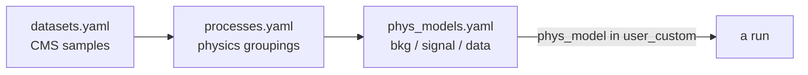

# Processes & physics models

[Datasets](datasets.md) are individual CMS samples. A **process** is the *physics* object you
actually plot and fit — one or more datasets grouped together (e.g. "TT", "DY", "signal"). A
**physics model** then declares which processes count as background, signal or data. Both are
analysis-specific config.

## `processes.yaml` — logical processes

```yaml
ProcessName:
  dataset_names:
    - DatasetName1
    - DatasetName2
  processor: ProcessorClass     # optional custom processor
  subProcesses:                 # optional composition from other processes
    - SubProcessName1
```

A process gathers the datasets that represent the same physics, optionally composes other
processes (`subProcesses`), and optionally names a custom `processor`.

### Meta-processes

A **meta-process** is a *template* that expands into a family of concrete processes — for example
"the resonant signal at every mass point" — instead of writing each one out. It is marked with
`is_meta_process: true` and expands at setup time (the [`PhysicsModel`](../concepts/configuration.md)
performs the expansion, substituting parameters such as the mass).

!!! info "Meta-processes are selectable directly"
    You can target a meta-process by name (e.g. `--process custom_CI_Signal`); FLAF expands it to
    its concrete member(s) for the requested era. This is what the CI uses for its signal test.

## `phys_models.yaml` — what is signal vs background vs data

```yaml
ModelName:
  backgrounds:
    - ProcessName1
    - ProcessName2
  signals:
    - SignalProcessName
  data:
    - DataProcessName
```

A model is just a named partition of processes into the three roles. Which model a run uses is set
by `phys_model` in [`user_custom.yaml`](user-custom.md) (or `--model`).

### `TestModel` vs the production model

- **`TestModel`** — a deliberately small set of processes, so the whole pipeline runs fast
  end-to-end. Use it for development, local testing and CI.
- **`BaseModel`** (or the analysis's named production model) — the full set used for real results.

!!! tip "Process names differ slightly between analyses"
    The CI process names are capitalised in the HH analyses (`custom_CI_Signal`,
    `custom_CI_Background`, `custom_CI_Data`) and lower-case in H→μμ (`custom_CI_signal`,
    `custom_CI_background`, `custom_CI_data`). Use the exact name from that analysis's
    `processes.yaml`.

## How processes relate to the rest



- A **dataset** is a file set on DAS.
- A **process** groups datasets into physics.
- A **model** labels processes as background/signal/data and is what a run actually uses.

See the [configuration system](../concepts/configuration.md) for how these files are loaded and
merged, and each analysis's docs for its concrete processes and models.
