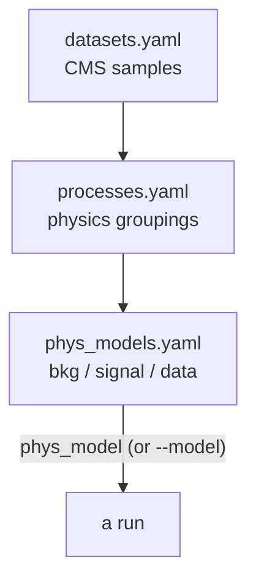

# Processes & physics models

[Datasets](datasets.md) are individual CMS samples. A **process** is the *physics* object you
actually plot and fit — one or more datasets grouped together (e.g. "TT", "DY", "signal"). A
**physics model** then declares which processes count as background, signal or data. Both are
analysis-specific config.

## `processes.yaml` — logical processes

The processes of an era are defined in `<analysis>/config/<era>/processes.yaml`. The
analysis-wide `config/processes.yaml` holds only shared YAML anchors under keys starting with
`.` (e.g. `.DY_processors: &DY_processors`): the files are concatenated before they are parsed,
so the era file can reference them, and the `.` keys themselves are dropped
([how the files combine](../concepts/configuration.md#how-values-combine)).

```yaml
ProcessName:
  name: "Label for plots"
  color: "kAzure-9"             # ROOT colour used in plots
  datasets:                     # the datasets that make up the process
    - DatasetName1
    - DatasetName2
  processors: *DY_processors    # optional: processors run for these datasets (a list)

GroupName:
  name: "DY"
  sub_processes:                # a group of other processes instead of datasets
    - ProcessName
    - OtherProcessName
```

A process either gathers the `datasets` that represent the same physics, or groups other
processes with `sub_processes` (resolved recursively down to processes with datasets) — never
both: `Setup` stops with an error when a process of the model has both. Analyses add further keys
(e.g. `corrections`, `genInfo`) that their own code reads from the process configuration.

`processors` is a list of entries, each naming a Python class that FLAF loads for given stages —
for example a [stitcher](../concepts/stitching.md#declaring-a-stitcher):

```yaml
  processors:
    - name: Stitcher
      module: FLAF.Processors.MCStitching
      class: MCStitcher
      config: FLAF/config/Processors/stitching_DY_amcatnlo_Vpt_NpNLO.yaml
      stages: [ AnaTuple, AnaTupleMerge ]
      dependency_level:
        AnaTuple: file
        AnaTupleMerge: process   # merge a dataset only together with its whole process
```

### Meta-processes

A **meta-process** is a *template* that expands into a family of concrete processes — for example
"the resonant signal at every mass point" — instead of writing each one out. It is marked with
`is_meta_process: true` and expanded by `Setup` while the configuration is loaded:

```yaml
custom_CI_Signal:
  is_meta_process: true
  meta_setup:
    dataset_name_pattern: XtoYHto2B2Wto2B2L2Nu_MX_(\d+)_MY_125   # regex groups = parameters
    parameters: [ MASS ]
    process_name: XtoHHto2B2W_2L_${MASS}
    name_pattern: Xto2B2W 2L ${MASS} GeV (x100)                  # plot label
    to_plot:
      - [ '300' ]                                                # parameter values drawn
    plot_color: [ "kBlack" ]
    channels: [ "eE", "eMu", "muMu" ]                            # optional
  datasets:
    - XtoYHto2B2Wto2B2L2Nu_MX_300_MY_125
```

Every listed dataset is matched against `dataset_name_pattern`; the datasets with the same
parameter values form one concrete process, named by `process_name`. A physics model that lists
the meta-process gets its concrete processes instead. Without `channels`, a member uses the
global `channelSelection`.

!!! info "Meta-processes are selectable directly"
    You can target a meta-process by name (e.g. `--process custom_CI_Signal` in HH→bb̄WW, where
    the CI signal is a meta-process for `Run3_2022` … `Run3_2023BPix`); FLAF expands it to its
    concrete member(s) for the requested era.

## `phys_models.yaml` — what is signal vs background vs data

```yaml
ModelName:
  name: "Label"               # optional
  backgrounds:
    - ProcessName1
    - ProcessName2
  signals:
    - SignalProcessName
  data:
    - DataProcessName
```

A model is just a named partition of processes into the three roles, in
`<analysis>/config/phys_models.yaml`. Any other key is an error, a process may appear only once,
and every listed process must be defined in the era's processes configuration. Which model a run uses is set
by `phys_model` — the analysis's `config/global.yaml` sets the production model, your
[`user_custom.yaml`](user-custom.md) usually overrides it, and `--model` overrides both.

### `TestModel` vs the production model

- **`TestModel`** — a deliberately small set of processes, so the whole pipeline runs fast
  end-to-end. Use it for development, local testing and CI. Every Run 3 era
  (`Run3_2022` … `Run3_2026`) defines a t̄t and a DY background of one dataset each (HH→bb̄WW adds
  a third, W background), plus one signal and one data process, under the CI names below.
- **`BaseModel`** (HH→bb̄ττ, H→μμ) or **`Run3_Model`** (HH→bb̄WW) — the production model, the full
  set used for real results.

!!! tip "Process names differ slightly between analyses"
    The CI process names are capitalised in the HH analyses (`custom_CI_Signal`,
    `custom_CI_Background_TT`, `custom_CI_Background_DY`, HH→bb̄WW also
    `custom_CI_Background_W`, `custom_CI_Data`) and lower-case in
    H→μμ (`custom_CI_signal`, `custom_CI_background_TT`, `custom_CI_background_DY`,
    `custom_CI_data`). Use the exact name from that analysis's `processes.yaml`.

!!! warning "A CI background must carry the processors its real process carries"
    The CI backgrounds exist to exercise the [stitching](../concepts/stitching.md) over the
    whole anaTuple → merge chain: each should declare the same `processors:` (and `genInfo:`) that
    the analysis gives its real `TT`, DY (and W) processes **in that era**, so a gen-level input the
    anaTuple does not keep fails the pipeline instead of the production. When you change a
    stitcher or the era's processors, change the matching CI process too. One dataset per
    process is enough — each stitching bin's denominator is summed over the very events that
    later read it back, so a bin no event falls into is never divided by.

## How processes relate to the rest


```mermaid
flowchart TD
    DS["datasets.yaml<br/>CMS samples"] --> PR["processes.yaml<br/>physics groupings"]
    PR --> PM["phys_models.yaml<br/>bkg / signal / data"]
    PM -->|"phys_model (or --model)"| RUN["a run"]
```

- A **dataset** is a set of NanoAOD files — a DAS dataset, or a directory on storage.
- A **process** groups datasets into physics.
- A **model** labels processes as background/signal/data and is what a run actually uses.

### From a dataset's process back to the model

A dataset's process is often not the entry `phys_models.yaml` lists: an expanded member
(`GluGluToRadion_bbTauTau_300`) stands for its meta-process (`GluGluToRadion_bbTauTau`), and a
sub-process stands for the group that lists it. `Setup` records each process's **direct parent**
— the meta-process it was expanded from, or the group listing it in `sub_processes` — and
walks back up from there:

| Call | Returns |
|---|---|
| `setup.process_parent(name)` | the direct parent, or `None` for a process nothing contains |
| `setup.process_ancestors(name)` | `[name, parent, grandparent, …]` |
| `setup.original_process(name)` | the topmost ancestor — for a process of the model, the entry the model lists |
| `setup.phys_model.listed_process_type(name)` | `backgrounds`, `signals` or `data` for an entry as `phys_models.yaml` lists it, meta-processes included |

This is the way for analysis code to tell which model entry a dataset belongs to, rather than
matching substrings of its process name; an anaTuple definition gets the `Setup` through its
`Initialize(setup, dataset_name)`. A process may be a sub-process of only one group, so that
its parent is unambiguous.

The `parent_process` key that `Setup` adds to each base process's configuration is something
else: the process of the model *after* meta-processes are expanded (`GluGluToRadion_bbTauTau_300`
itself), which is what histograms are merged under.

See the [configuration system](../concepts/configuration.md) for how these files are loaded and
merged, and each analysis's docs for its concrete processes and models.
