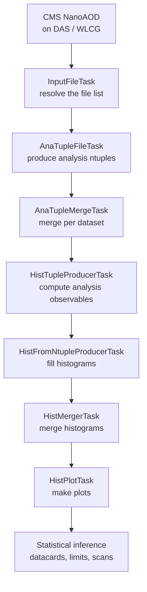

# FLAF

**FLAF** — the **F**lexible **LA**W-based Analysis **F**ramework — is the shared software
framework behind several CMS Higgs-sector analyses at CERN. It turns CMS
[NanoAOD](https://twiki.cern.ch/twiki/bin/view/CMSPublic/WorkBookNanoAOD) files into the
analysis ntuples, histograms, plots and statistical results that go into a physics paper.

FLAF organises this work as a chain of **tasks** managed by
[LAW](https://github.com/riga/law) (the Luigi Analysis Workflow). You describe *what* you want
(for example, "the final plots for the 2022 data"); LAW figures out *which* intermediate steps
are needed, runs only those, and can dispatch them to the CERN HTCondor batch system.

!!! tip "New here? You are in the right place."
    These docs assume **no prior experience** with LAW, Luigi or batch computing. If your
    background is physics rather than software engineering, start with
    [Key terms](getting-started/key-terms.md) and the [Getting started](getting-started/prerequisites.md)
    track — every concept is introduced from scratch.

## The big picture

FLAF is shared by three analyses — **HH→bb̄ττ**, **HH→bb̄WW** and **H→μμ** — which all run the
same pipeline. From CMS NanoAOD to final results, the stages are:

Each box is a LAW **task**. You normally run only the *last* task you care about — LAW pulls in
everything upstream automatically. The whole pipeline is explained step by step in the
[full-workflow walkthrough](workflow/walkthrough.md).

## How to read these docs

The documentation is organised so you can enter at the level you need.

- :material-rocket-launch: **I'm new — get me running**

    Follow the [Getting started](getting-started/prerequisites.md) track: prerequisites →
    installation → your first run. Then skim [Key terms](getting-started/key-terms.md).

- :material-lightbulb-on: **I want to understand how it works**

    Read [Concepts](concepts/architecture.md): the architecture, what a LAW task is, the data
    flow, the configuration system, eras, storage and the environment.

- :material-cog: **I need to run the analysis**

    Use the [Full workflow](workflow/walkthrough.md) walkthrough and the
    [Command arguments](workflow/arguments.md) cheat-sheet. Scale up with
    [Running on HTCondor](workflow/htcondor.md).

- :material-book-open-variant: **I'm looking something up**

    Jump to the [Task reference](reference/tasks.md), the [Configuration guide](configuration/user-custom.md),
    the [Glossary](glossary.md) or [Troubleshooting](troubleshooting.md).

## What FLAF is — and is not

- FLAF is a **framework**, not an analysis. It lives in the [`cms-flaf/FLAF`](https://github.com/cms-flaf/FLAF)
  repository and is included as a **git submodule** inside each analysis repository. You never
  clone FLAF on its own to run an analysis — you clone an analysis repository (which brings FLAF
  with it). See [Architecture](concepts/architecture.md) and [Installation](getting-started/installation.md).
- FLAF provides the **common machinery**: the task definitions, the configuration system, the
  environment setup, the storage abstraction and the CI. The **physics specifics** (which
  signals, which observables, which categories) live in each analysis repository and are
  documented there — see [Analyses](analyses.md).

## Getting help

- **Something went wrong?** Check [Troubleshooting](troubleshooting.md) first — it collects the
  most common pitfalls and their fixes.
- **An unfamiliar word?** The [Glossary](glossary.md) translates framework vocabulary into
  analyst terms.
- **Found a docs problem?** Use the :material-pencil: edit icon on any page to open a pull
  request, or open an issue on [GitHub](https://github.com/cms-flaf/FLAF/issues).
