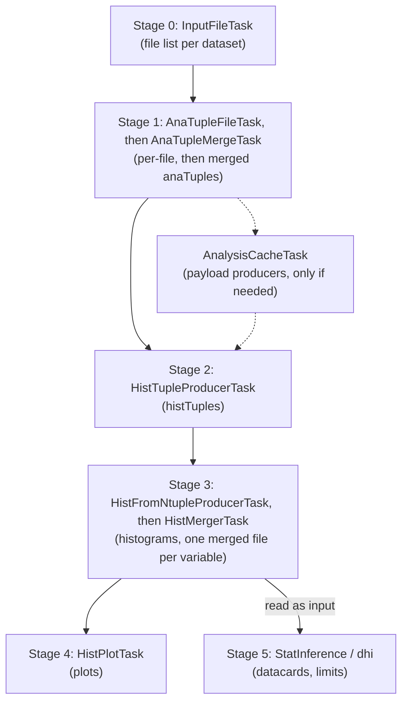

# Full workflow walkthrough

This is the end-to-end tour of the pipeline: every stage, in order, with the command that runs it.
Read it once to understand the chain; in day-to-day work you usually run only the *last* stage you
need and let LAW produce the rest (see [the shortcut](#the-shortcut-just-ask-for-the-end)).

The commands use `FLAF.AnaProd.tasks.*` for production stages and `FLAF.Analysis.tasks.*` for
analysis stages — the fully-qualified task paths the framework registers.



Launching a stage makes LAW run the stages above it that are missing; the dashed path runs only
when the analysis needs it (Stage 2). Stage 5 is the exception: it reads the merged histograms
but does not produce them.

## Setup recap

```sh
cd HH_bbtautau          # your analysis repository
source env.sh           # once per shell
voms-proxy-info         # confirm a valid proxy

# Pick a data-taking era and a label for this production:
ERA=Run3_2022
VER=dev
```

Throughout, `--period $ERA` selects the [era](../concepts/eras.md) and `--version $VER` namespaces
the [outputs](../concepts/data-flow.md#versions-keep-productions-apart). Add `--workflow local`
to run on this machine; switch to `--workflow htcondor` to scale up
([HTCondor guide](htcondor.md)). Always pass `--workflow`: without it, LAW submits to HTCondor.

---

## Stage 0 — Resolve the input files

`InputFileTask` turns "the datasets for this era" into a concrete list of NanoAOD files per
dataset. It lists them from the dataset's own `fs_nanoAOD` if it has one; otherwise from the era's
`fs_nanoAOD` (the HLepRare skims) when `nanoAODVersions` selects `HLepRare` for data or MC (the
default when it is unset), or through Rucio for the DAS dataset that the dataset's `nanoAOD:` entry
names for the selected version
(see [Where the inputs come from](../concepts/storage.md#where-the-inputs-come-from)).
Everything else depends on it, so it runs first — automatically when you launch a later stage, or
explicitly:

```sh
law run FLAF.AnaProd.tasks.InputFileTask --period $ERA --version $VER --workflow local
```

It always runs locally and is fast and cheap. If a from-scratch run unexpectedly *stays* in
`InputFileTask` or fails here, suspect a wrong `--period`/`--version` or an expired proxy.

## Stage 1 — Produce and merge analysis ntuples (anaTuples)

`AnaTupleFileTask` runs the producer (`AnaProd/anaTupleProducer.py`, driven by the analysis's
`anaTupleDef`) over each NanoAOD file — **one branch per file** — applying the object selections
and [corrections](../concepts/architecture.md#common-vs-analysis-specific) and writing a slimmed
**anaTuple** plus a JSON report. It runs in the FLAF environment, or inside CMSSW when the analysis
sets `use_cmssw_env_AnaTupleProduction: true` (HH→bb̄ττ does). Before the first production jobs,
`AnaTupleCostProbeTask` times the producer on a few thousand events of one file per dataset so
that branches can be
[packed into jobs by cost](htcondor.md#how-branches-become-jobs) (unless
`anaTuple_scheduling.probe_enabled` is `false`).

`AnaTupleFileListBuilderTask` then reads the reports and writes a **merge plan** per dataset, and
`AnaTupleMergeTask` merges the per-file pieces following it into files of about `nEventsPerFile`
events (`anaTuple_<N>.root`, one branch per merged file), so a dataset usually ends up with
several. All data datasets of the era are merged into one sample, `data`. See
[How the anaTuples are merged](../concepts/data-flow.md#how-the-anatuples-are-merged).

```sh
# Produce per-file anaTuples (heavy; normally on HTCondor):
law run FLAF.AnaProd.tasks.AnaTupleFileTask --period $ERA --version $VER --workflow local

# Build the merge plans and merge (runs the steps above first if needed):
law run FLAF.AnaProd.tasks.AnaTupleMergeTask --period $ERA --version $VER --workflow local
```

!!! tip "Test on a few files first"
    `--test 1000` keeps only the **first input file of every dataset** and processes at most 1000
    events of it. `--branches 0,1,2` additionally restricts `AnaTupleFileTask` to its first three
    branches — with `--test`, the first file of each of the first three datasets. Give test runs
    their own `--version`: their outputs have the same paths as a full run's
    (see [`--test`](arguments.md#common-task-options)).

## Stage 2 — Compute analysis observables (histTuples)

`HistTupleProducerTask` runs `Analysis/HistTupleProducer.py` with the analysis's `histTupleDef`
over each merged anaTuple file — **one branch per merged file** — computing the analysis variables
and final event weights and writing **histTuples**:

```sh
law run FLAF.Analysis.tasks.HistTupleProducerTask --period $ERA --version $VER --workflow local
```

!!! note "Analysis caches: payload producers run first"
    If a variable of the active histTuple flavour is delivered by a **payload producer** (an entry
    of `payload_producers` in `global.yaml`, e.g. a DNN score, with columns named
    `<producer>_<column>`), `AnalysisCacheTask` runs that producer first, one branch per merged
    anaTuple file, and `HistTupleProducerTask` reads its output alongside the anaTuple. All three
    analyses define payload producers, and whether these run depends on the flavour's variables.
    A global producer that a correction names as its `normCacheProducer` runs whatever the
    variables; if it also needs aggregation — today HH→bb̄WW's `BtagShape` b-tag shape
    normalisation — its output is summed per dataset by `AnalysisCacheAggregationTask`. These tasks are
    pulled in automatically and can be **time-consuming**; each producer sets its own `n_cpus` and
    `max_runtime`. See
    [Payload producers and the analysis cache](../concepts/data-flow.md#payload-producers-and-the-analysis-cache)
    and the [Task reference](../reference/tasks.md).

## Stage 3 — Fill and merge histograms

`HistFromNtupleProducerTask` fills **histograms** of the requested variables from the histTuples —
**one branch per (dataset, file-chunk)**, including the Up/Down variations when
`compute_unc_histograms` is on. If the booked histogram count (with Up/Down) exceeds
`hist_from_ntuple_max_hists`, the producer fills them in batches. `HistMergerTask` then merges the
pieces of each variable into one file with the histograms per process — **one branch per
variable** — ready for plotting and fitting.

```sh
# Fill histograms (restrict variables with --variables, set files/job with --n-files-per-job):
law run FLAF.Analysis.tasks.HistFromNtupleProducerTask --period $ERA --version $VER --workflow local

# Merge them:
law run FLAF.Analysis.tasks.HistMergerTask --period $ERA --version $VER --workflow local
```

Which variables are produced is controlled by the analysis config and can be narrowed with the
`--variables a,b` parameter (on `HistFromNtupleProducerTask`, `HistMergerTask` and `HistPlotTask`)
or the `variables:` list in `user_custom.yaml`.

## Stage 4 — Make the plots

`HistPlotTask` produces the final plots — **one branch per variable**:

```sh
law run FLAF.Analysis.tasks.HistPlotTask --period $ERA --version $VER --workflow local
# one variable only:
law run FLAF.Analysis.tasks.HistPlotTask --period $ERA --version $VER --workflow local --branches 0
```

This is the task you most often launch directly: asking for the plots makes LAW produce every
upstream product that is missing.

## Stage 5 — Statistical inference

The two HH analyses turn the merged histograms into datacards and then run limits and diagnostics
with [Combine](https://cms-analysis.github.io/HiggsAnalysis-CombinedLimit/), via the
`StatInference` and `inference` (dhi) submodules. H→μμ does not include this stage. There are two
routes; the exact configs and options are analysis-specific — see each analysis's **Statistical
inference** page (linked from [Analyses](../analyses.md)) and the
[cms-hh inference docs](https://cms-hh.web.cern.ch/tools/inference/).

### The StatInference law chain

`StatInference` provides a law chain, which HH→bb̄WW uses. An analysis enables it by listing
`StatInference.law.tasks` in its `config/law.cfg` and naming its datacard configuration under
`StatInference: config:` in `global.yaml` (HH→bb̄WW: `config/Datacards/x_hh_bbww_DL_run3.yaml`):

```sh
law run PlotResonantLimitsTask --version $VER --hists-version <VERSION_OF_THE_MERGED_HISTS> \
  --period $ERA --workflow local
```

It runs `PreprocessShapesTask` (only when the configuration declares a `preprocess:` step), then
`CreateDatacardsTask`, `ResonantLimitsTask` and `PlotResonantLimitsTask`; `PlotPullsAndImpactsTask`
draws pulls and impacts, and `ResonantLimitsAndHistPlotTask` (what the HH→bb̄WW CI runs) asks for
the limits together with `HistPlotTask` for every era of the configuration. The chain reads the
merged histograms of `--hists-version` (default: `--version`) as an external input, so produce
them first. It runs from the normal FLAF shell: the tasks run the steps that need CMSSW inside it
themselves.

### Step by step

This is the route HH→bb̄ττ documents. The datacard script needs the CMSSW environment, so prefix
it with `cmsEnv`. The limits and pulls & impacts are the dhi tasks `PlotResonantLimits` and
`PlotPullsAndImpacts` (no `Task` suffix) from `inference.dhi.tasks`, which both HH analyses list
in `config/law.cfg`:

```sh
# 1) Create datacards from the produced shapes:
cmsEnv python3 StatInference/dc_make/create_datacards.py \
  --input  <PATH_TO_SHAPES> \
  --output <PATH_TO_CARDS> \
  --config <PATH_TO_CONFIG>      # the analysis's datacard configuration

# 2) Run resonant limits:
law run PlotResonantLimits --version $VER --datacards '<PATH_TO_CARDS>/*.txt' --xsec fb --y-log

# 3) Pulls & impacts (per mass point — point at a single card):
law run PlotPullsAndImpacts --version $VER --datacards "<PATH_TO_CARDS>/<one_card>.txt" ...
```

---

## The shortcut: just ask for the end

You rarely run the stages one by one. Because every task knows its dependencies, launching a late
stage runs all missing upstream stages automatically:

```sh
law run FLAF.Analysis.tasks.HistPlotTask --period $ERA --version $VER --workflow local
```

This holds for stages 0–4; the Stage 5 chain does not produce the merged histograms it reads. Run
the individual stages explicitly only when you want to **stop at** an intermediate product
(e.g. produce anaTuples for someone else to use), or to inspect/debug one stage.

## See progress and redo selectively

```sh
# Status of the whole tree (task depth 3, target-collection depth 1) — also prints output paths:
law run FLAF.Analysis.tasks.HistPlotTask --period $ERA --version $VER --workflow local --print-status 3,1

# Force one stage to be recomputed (remove its outputs, then run it) — keep --workflow, or the
# re-run goes to HTCondor:
law run FLAF.Analysis.tasks.HistMergerTask --period $ERA --version $VER --workflow local --remove-output 0,a,y
```

See [Command arguments](arguments.md) for the full option list, and [Running on HTCondor](htcondor.md)
to take any of these commands to the batch system by swapping `--workflow local` for
`--workflow htcondor`.
